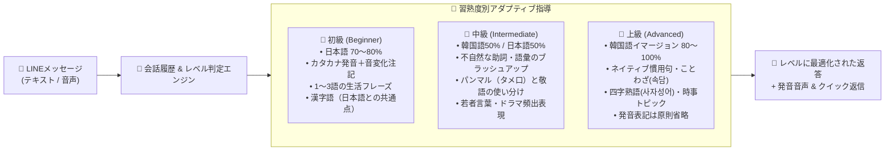
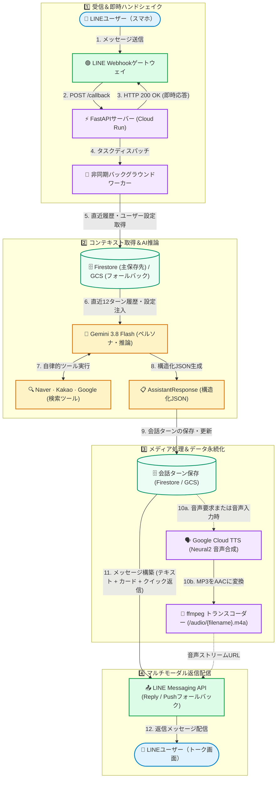
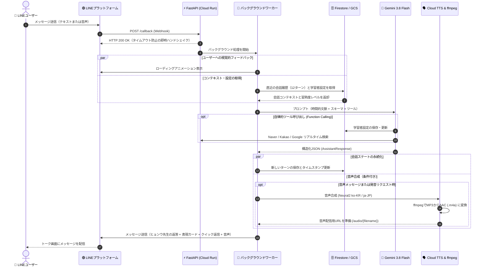
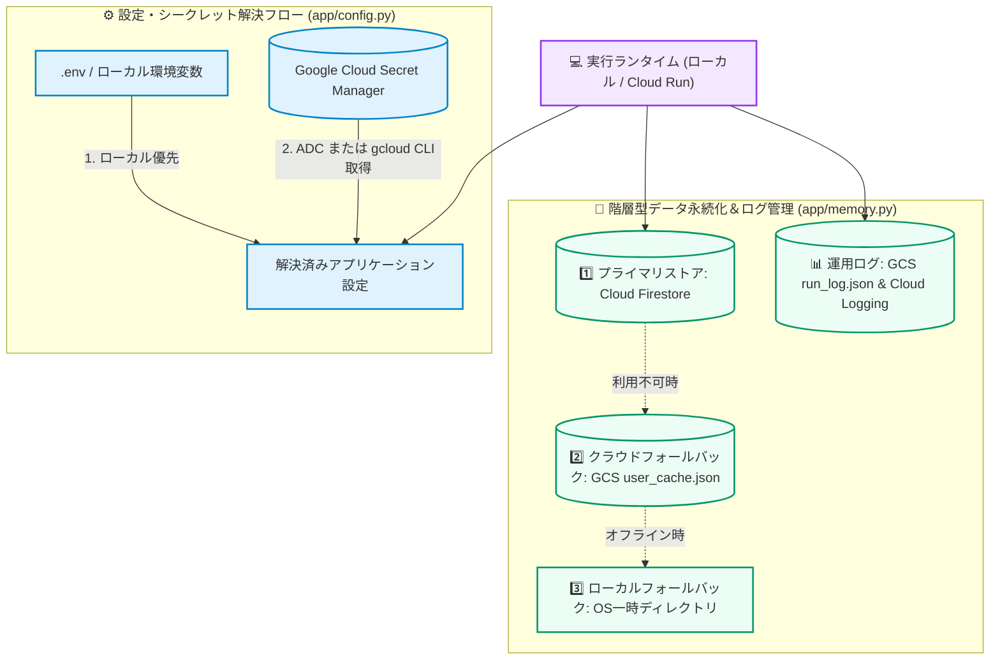

# 🇰🇷🇯🇵 KoreanTeacher_LINE

LINEで学べるAI韓国語学習パートナー＆ガイドボット！  
ソウル出身のネイティブ韓国語講師**「キム・ヒョンウ（김현우）」先生**が、まるで頼れる優しいお兄さん（ヒョン／オッパ）のように、チャットを通じて楽しく自然な韓国語会話をサポートします。

> 📖 [English README](./README.md) はこちら

---

## ✨ 主な特徴

- **👨‍🏫 キム・ヒョンウ先生（김현우）**
  - 日本が大好きなソウル出身の韓国語講師。生徒の小さな挑戦も全力で肯定し、褒めて伸ばすスタイルで楽しく会話できます。
- **🤝 人間らしい生きた対話＆オウム返し防止（Anti-Repetition）**
  - 生徒が同じ言葉や挨拶、質問を繰り返した場合でも、機械的に全く同じ解説や返答を繰り返すことはありません。
  - 生徒が習った表現をアウトプットした際には「대박! 早速使ってくれましたね！👏」と実践を全力で褒め、新しい例文やイントネーションのコツ、会話を広げるパスを投げかけます。
- **🎯 習熟度レベルに応じた最適化＆永続記憶**
  - 生徒の韓国語習熟度（`beginner`（初級）, `intermediate`（中級）, `advanced`（上級））を **Firestore** に永続記録し、返信言語の比率や解説の深さを動的に調整：
    - **初級 (Beginner)**: 日本語中心（70〜80%）、丁寧なカタカナ発音ヒント（連音化・音変化の注記付き）、基礎フレーズ、日本語との共通点（漢字語）を重視。
    - **中級 (Intermediate)**: 韓国語50%・日本語50%のバランス、ネイティブらしい自然な言い回しへのブラッシュアップ、パンマル（タメ口）と敬語の使い分け、若者言葉やドラマ頻出表現。
    - **上級 (Advanced)**: 韓国語イマージョン（80〜100%）、洗練されたネイティブ特有の慣用表現、ことわざ（속담）、四字熟語、時事トピック、発音ヒントは原則省略。
  - 「初心者です」「TOPIK4級です」といった自己申告はもちろん、日々のチャット内容から先生が自動で判定・更新します。
- **💬 機械的な添削・採点のない自然な会話**
  - 文法テストのような減点方式ではなく、ネイティブならではの自然なニュアンスや表現をリアクションの中に自然に織り交ぜて教えます。
- **✨ キーフレーズカード表示**
  - 会話に出てきた重要な韓国語フレーズを、カタカナ発音のヒント（連音化や濃音化などのポイント付き）と日本語訳を添えて分かりやすく提示します。
- **🔘 LINE クイック返信（Quick Reply）ボタン対応**
  - 毎回の返信に2〜4個のワンタップボタン（例: `[네, 맞아요!]`、`[タメ口では？]`、`[発音を聞かせて🔊]`）を自動生成。スマホでのハングル入力の手間を減らし、スムーズに会話を続けられます。
- **🗣️ 音声メッセージ＆オンデマンド発音再生**
  - ユーザーが送信したボイスメッセージ（LINE音声）を聴いてフィードバック。
  - 「発音を聞かせて🔊」ボタンのタップや「発音を聞かせて」というリクエストに応じて、ネイティブ音声（m4a）を即座に生成して返信します。
- **💡 日本語との共通点（漢字語）を活かしたアハ体験**
  - 韓国語の約70%を占める漢字語（約束 = 약속、無料 = 무료、カバン = 가방 など）を積極的に紹介し、日本人学習者が直感的に覚えられるよう導きます。
- **🔍 リアルタイム韓国トレンド・旅行情報検索**
  - Naver検索（ブログ・Web）、Kakao/Daum検索、Google検索と連携。最新のカフェ、グルメ、観光地、流行表現などをリアルタイムに検索して回答します。
- **🧠 時間認識型 短期コンテキスト＆長期記憶アーキテクチャ**
  - **時間認識型 短期コンテキスト**: ユーザーごとに最大40ターンを保存し、そのうち直近12ターン（6往復）をISO-8601タイムスタンプ（JST/KST - UTC+9）付きでGeminiに送信。ターン間の経過時間を会話の時間的背景として使い、同日中や数日ぶりの再開を自然に扱います。
  - **長期記憶**: 生徒の習熟度レベル（初級/中級/上級）、会話履歴、呼び名や学習目的、好きなアイドルなどの好みをFirestoreに保存します。Firestoreを初期化できない場合はGCSのJSONキャッシュを使用し、GCSも利用できない場合はOS一時ディレクトリにフォールバックします。
  - **休眠復帰チェックイン**: デフォルトで最終利用から3〜14日経過したユーザーを抽出し、LINEプッシュ用のメッセージを生成します。`/cron/check-in` または `scripts/trigger_check_in.py` から実行でき、デフォルトのクールダウンは7日です。エンドポイントは `CRON_SECRET` を設定した場合のみ認証されます。
- **☁️ サーバーレス＆クラウドネイティブ**
  - Google Cloud Run上でコンテナとして稼働。アイドル時はインスタンス数がゼロにスケールダウンするため、低コストで運用可能です。

---

## ⚙️ 技術スタック

| コンポーネント | 利用技術 | 役割 |
|---|---|---|
| **バックエンドフレームワーク** | [FastAPI](https://fastapi.tiangolo.com/) | 非同期Webhookルーティング、ヘルスチェック、音声ストリーミング |
| **生成AI** | [Google GenAI SDK](https://ai.google.dev/) (`gemini-3.8-flash`) | 会話生成、JSON構造化出力（Pydantic）、Function Callingツール実行 |
| **メッセージングプラットフォーム** | [LINE Messaging API SDK v3](https://developers.line.biz/ja/docs/messaging-api/) | Webhook検証、メッセージ送受信、クイック返信、音声メッセージ配信 |
| **データベース・記憶** | [Google Cloud Firestore](https://cloud.google.com/firestore) | 会話履歴の保持および永続的なユーザー指示・好みの保存 |
| **音声合成・変換** | [Google Cloud Text-to-Speech](https://cloud.google.com/text-to-speech) + `ffmpeg` | Neural2音声（`ko-KR-Neural2-C`, `ja-JP-Neural2-D`）の生成とAAC (`.m4a`) 変換 |
| **外部検索連携** | [Naver Developers](https://developers.naver.com/) & [Kakao Developers](https://developers.kakao.com/) | 韓国のWeb・ブログ・地域情報のリアルタイム取得 |
| **インフラ・コンテナ** | [Google Cloud Run](https://cloud.google.com/run) & Docker | フルマネージドのサーバーレスコンテナ実行環境 |

---

## 📱 システム画面プレビュー & 会話体験

### 1. LINEトーク画面イメージ（初級対応 & 練習リピートへの自然なリアクション）

```
┌────────────────────────────────────────────────────────┐
│ 🟢 LINEトーク: キム・ヒョンウ先生（김현우）             │
├────────────────────────────────────────────────────────┤
│                                                        │
│ [生徒] 👤                                              │
│ 今日めっちゃ疲れた〜                                   │
│                                                        │
│ 👨‍🏫 [ヒョヌ先生]                                       │
│ 今日もお疲れ様でした！本当によく頑張りましたね✨        │
│ 韓国語では『오늘 너무 피곤했어요~』って言います。     │
│ 温かいお風呂に入ってゆっくり休んでくださいね！         │
│ 明日は何時に起きる予定ですか？                         │
│                                                        │
│ ┌────────────────────────────────────────────────────┐ │
│ │ ✨ 今日のキー表現：                                │ │
│ │ 『 오늘 너무 피곤했어요 』                         │ │
│ │ 🗣️ 発音：オヌル ノム ピゴネッソヨ                   │ │
│ │ 🇯🇵 意味：今日すごく疲れました                       │ │
│ └────────────────────────────────────────────────────┘ │
│                                                        │
│ [生徒] 👤                                              │
│ 오늘 너무 피곤했어요                                   │
│                                                        │
│ 👨‍🏫 [ヒョヌ先生] （※オウム返しせず、練習を褒めて発展）│
│ 대박! 早速使ってくれましたね！👏 発音もバッチリ伝わって│
│ きます！友達同士のタメ口なら『오늘 너무 피곤했어』     │
│ って言えばOKですよ😊 今夜はぐっすり眠れそうですか？    │
│                                                        │
│ ┌────────────────────────────────────────────────────┐ │
│ │ 🔊 音声メッセージ (m4a) [▶ 0:02 / 0:02]            │ │
│ └────────────────────────────────────────────────────┘ │
│                                                        │
├────────────────────────────────────────────────────────┤
│ 💡 ワンタップ返信 (Quick Reply):                       │
│ [네! (はい!)]  [タメ口では？]  [発音を聞かせて🔊]      │
└────────────────────────────────────────────────────────┘
```

### 2. 生徒の習熟度レベルに応じた動的対応マップ



---

## 🏗️ アーキテクチャ＆データフロー

LINE Messaging APIのタイムアウトを防ぎ、高速で安定したユーザー体験を提供するため、Webhook即時応答（`HTTP 200 OK`）と、AI推論・外部検索・音声合成・データ永続化パイプラインを完全分離しています。

### 1. エンドツーエンド処理パイプライン



### 2. リクエスト・レスポンス シーケンス＆非同期ライフサイクル



---

## 📁 ディレクトリ構成

```
KoreanTeacher_LINE/
├── app/
│   ├── __init__.py               # パッケージ初期化ファイル
│   ├── config.py                 # マルチPC設定管理・Secret Manager解決モジュール
│   ├── gemini_client.py          # Geminiモデル設定、ペルソナプロンプト、Firestore記憶機能、検索ツール
│   ├── main.py                   # FastAPIアプリ、LINE Webhookハンドラー、TTSパイプライン、バックグラウンド処理
│   ├── memory.py                 # 2層GCSステート永続化・分離監査ログモジュール
│   └── web_search.py             # Naver、Kakao、Googleカスタム検索の連携モジュール
├── docs/
│   └── naver_kakao_api_guide.md  # Naver & Kakao APIキー取得手順書
├── scripts/
│   ├── deploy.ps1                # Cloud Run自動デプロイ用PowerShellスクリプト
│   ├── sync_secrets.py           # マルチPCシークレット同期・GCS初期化スクリプト
│   └── trigger_check_in.py       # 休眠チェックインのプレビュー・送信CLI
├── .dockerignore                 # Dockerイメージビルド時の除外設定
├── .env.example                  # 環境変数テンプレート・設定リファレンス
├── .gcloudignore                 # Cloud Buildパッケージング時の除外設定
├── .gitignore                    # Git管理対象外設定 (.env, venv等)
├── Dockerfile                    # Python 3.11-slim + ffmpeg 構成のコンテナ定義
├── README.md                     # 英語ドキュメント
├── README.ja.md                  # 日本語ドキュメント（本ファイル）
└── requirements.txt              # Python依存ライブラリ一覧
```

主なファイル:
- [app/main.py](app/main.py): FastAPIのエンドポイント定義、LINE Webhook受信処理、音声ストリーミング
- [app/config.py](app/config.py): Secret Manager SDK、`gcloud` CLI、環境変数を透過的にフォールバック解決するデュアルモード設定管理
- [app/gemini_client.py](app/gemini_client.py): `gemini-3.8-flash` の設定、Pydanticレスポンスモデル、プロンプト、Firestore永続化
- [app/memory.py](app/memory.py): GCS JSONステート保存とCloud Logging向け構造化ログ出力。ローカルキャッシュはOS一時ディレクトリに保存
- [app/web_search.py](app/web_search.py): Naverブログ/Web、Kakaoブログ/Web、Googleカスタム検索の実行モジュール
- [docs/naver_kakao_api_guide.md](docs/naver_kakao_api_guide.md): NaverおよびKakaoの開発者登録とAPIキー取得方法の解説
- [scripts/deploy.ps1](scripts/deploy.ps1): Google Cloud Runへ自動デプロイするスクリプト
- [scripts/sync_secrets.py](scripts/sync_secrets.py): マルチPCシークレット同期およびゼロセットアップ診断ツール
- [scripts/trigger_check_in.py](scripts/trigger_check_in.py): 休眠ユーザー向けチェックインのプレビューおよびLINEプッシュ送信
- [Dockerfile](Dockerfile): 非rootユーザー実行・ffmpeg導入済みの本番用コンテナ定義
- [requirements.txt](requirements.txt): 必要パッケージ一覧

---

## 🔌 APIエンドポイント

| エンドポイント | メソッド | 説明 |
|---|---|---|
| `/callback` | `POST` | LINE Messaging APIのWebhookエンドポイント。署名検証（`X-Line-Signature`）を行い、テキスト・音声・友だち追加/ブロック解除イベント等を処理します。 |
| `/health` | `GET` | 稼働確認・診断用エンドポイント。モデル名、Base URL、外部検索APIの設定有無を返します。 |
| `/audio/{filename}` | `GET` | 合成された `.m4a` 音声ファイルをLINEの `AudioMessage` 再生用に配信します。 |
| `/cron/check-in` | `POST` / `GET` | 休眠ユーザーを検索し、チェックインを生成します。`dry_run=true` 以外ではLINE Push APIで送信します。`CRON_SECRET` 設定時のみ `X-Cron-Secret` ヘッダーまたは `secret` クエリで認証されます。`min_days`、`max_days`、`cooldown_days`、`dry_run` を指定できます。 |

---

## 🧠 メモリ＆時間認識アーキテクチャ

長期的な学習パートナーとしての価値を最大化するため、ユーザーID単位で以下の多層メモリ＆時間認識システムを備えています：

| コンポーネント | 範囲・保存先 | 仕組み・動作 |
|---|---|---|
| **時間認識型 短期コンテキスト** | Firestore（主保存先）、利用できない場合はGCS JSONキャッシュ | ISO-8601タイムスタンプ付きで最大40ターンを保存し、直近**12ターン（6往復分）**をGeminiへ送信。経過時間に応じて会話中、同日中の再開、数日ぶりの再開を自然に扱います。 |
| **長期記憶** | Firestore（主保存先）、利用できない場合はGCS JSONキャッシュ | 生徒の**習熟度レベル**（`beginner`, `intermediate`, `advanced`）と、明示的な**カスタム指示・好み**（呼び名、学習目標、好きなK-POPグループ、話し方の希望など）を保存し、毎回のシステム指示へ反映します。 |
| **自律チェックイン（休眠復帰）** | `/cron/check-in` エンドポイントまたは `scripts/trigger_check_in.py` | デフォルトで**3〜14日間**利用がないユーザーを抽出します。送信時はデフォルトで**7日間のクールダウン**を適用し、配信停止の希望も尊重します。エンドポイントは `CRON_SECRET` 未設定時には認証されません。 |

*※プライバシー配慮：ユーザーがボットをブロックまたは友達解除（Unfollow）した際、FirestoreとGCSフォールバックキャッシュから該当ユーザーの履歴・プロファイルを削除します。*

---

## ☁️ マルチPC対応 クラウドネイティブ・アーキテクチャ

ローカル開発とCloud Runは同じ設定・永続化コードを使用します。環境変数がSecret Managerより優先され、Secret ManagerはADCを使用して読み込みます。ADCで取得できない場合は `gcloud` CLIでシークレットを読み込みます。ユーザーの会話・プロファイル情報はFirestoreを主保存先とし、GCSはJSONフォールバックキャッシュと運用ログに使用します。



### 1. クラウドシークレットの解決
ローカルの `.env` にある値が優先されます。環境変数に値がない場合、アプリはADCを使って**Google Cloud Secret Manager**から取得し、取得できなければログイン済みの `gcloud` CLIを試します。解決した値はプロセス内にキャッシュされます。

### 2. ユーザーデータとフォールバック保存先
- Firestoreクライアントを初期化できる場合、会話履歴とユーザープロファイルは**Firestore**に保存されます。
- Firestoreを利用できない場合、`gs://<bucket>/korean_teacher/user_cache.json` を読み書きします。GCS Python SDKでアクセスできない場合は、認証済みの `gcloud storage` CLIを利用できます。
- Cloud Storageも利用できない場合は、OS一時ディレクトリ（`tempfile.gettempdir()`）にキャッシュします。このローカルフォールバックは、別のマシンやCloud Runインスタンスを越えて保持される永続ストレージではありません。

### 3. 実行ログ・監査ログの完全分離
- 会話ステートとシステムの運用ログ（実行時間、タイムスタンプ、エラー詳細）は完全に分離されています。
- 運用ログは `gs://<bucket>/korean_teacher/run_log.json` に蓄積されると同時に構造化JSONとして `stdout` に出力され、**Google Cloud Logging** に自動収集されます。

---

## 🔑 設定項目と Secret Manager キー名

| 設定項目 | Secret Manager ID | 環境変数フォールバック | 説明 |
|---|---|---|---|
| Gemini API キー | `gemini-api-key` | `GEMINI_API_KEY` | モデル推論用 Gemini API キー |
| LINE チャネルシークレット | `korean-teacher-line-channel-secret` | `LINE_CHANNEL_SECRET` | LINE Webhook 署名検証用チャネルシークレット |
| LINE アクセストークン | `korean-teacher-line-channel-access-token` | `LINE_CHANNEL_ACCESS_TOKEN` | 返信送信用の長期チャネルアクセストークン |
| GCP プロジェクト ID | — | `GOOGLE_CLOUD_PROJECT` または `GCP_PROJECT` | GCP プロジェクト ID（未指定時は `gcloud` から自動検出） |
| GCS バケット名 | `korean-teacher-bucket-name` | `GCS_BUCKET_NAME` | Cloud Storage バケット名（デフォルト: `<project-id>-korean-teacher-data`。プロジェクトIDを解決できない場合は `korean-teacher`） |
| Gemini モデル | — | `GEMINI_MODEL` | モデル名（デフォルト: `gemini-3.8-flash`） |
| 公開ベース URL | — | `BASE_URL` | TTS音声URLの生成に使う公開URL（デフォルト: `http://localhost:8080`）。ローカル開発時はローカルサーバーのURLを設定します。 |
| コンテナポート | Cloud Run `PORT` | `PORT` | Docker起動時に待ち受けるポート（デフォルト: `8080`）。ローカル実行例では `8000` を使用します。 |
| Cronシークレット（任意） | `cron-secret`（標準候補） | `CRON_SECRET` | 設定すると `/cron/check-in` の認証を有効化します。`X-Cron-Secret` ヘッダーまたは `secret` クエリで指定します。未設定時は認証されません。 |
| Naver 検索（任意）| `naver-client-id`, `naver-client-secret` | `NAVER_CLIENT_ID`, `NAVER_CLIENT_SECRET` | 韓国ローカル情報・ブログ検索用キー |
| Kakao 検索（任意）| `kakao-rest-api-key` | `KAKAO_REST_API_KEY` | Daum Web・ブログ検索用 REST API キー |
| Google カスタム検索（任意）| `google-search-api-key`, `google-search-cx` | `GOOGLE_SEARCH_API_KEY`, `GOOGLE_SEARCH_CX` | Google Custom Search API キーおよびエンジン ID |

---

## 🛠️ マルチPC管理ツール (`scripts/sync_secrets.py`)

同梱の [scripts/sync_secrets.py](scripts/sync_secrets.py) スクリプトにより、どのマシンからでもクラウド連携のテストやシークレット登録が行えます：

```bash
# 1. ゼロセットアップ疎通確認（Secret Manager および GCS へのアクセスをドライラン検証）
python scripts/sync_secrets.py --dry-run

# 2. Cloud Storage バケットの自動作成・確認
python scripts/sync_secrets.py --init-bucket

# 3. ローカルの .env の値を Secret Manager に一括登録（必要時のみ）
python scripts/sync_secrets.py --push-env .env
```

`--project <project-id>` で `gcloud` のアクティブプロジェクトを上書きできます。複数の処理を同時に指定することもできます（例: `python scripts/sync_secrets.py --project <project-id> --init-bucket --dry-run`）。`--push-env` がSecret Managerへ登録するのは認識対象のAPI資格情報だけで、`BASE_URL` や `GCS_BUCKET_NAME` などの設定値は対象外です。

### 休眠チェックインCLI

[scripts/trigger_check_in.py](scripts/trigger_check_in.py) で対象ユーザーと生成メッセージを確認できます。デフォルトはドライランで、実際にLINEプッシュを送信するには `--send` を指定します。

```bash
python scripts/trigger_check_in.py --dry-run
python scripts/trigger_check_in.py --send --min-days 3 --max-days 14 --cooldown-days 7
python scripts/trigger_check_in.py --user-id U12345678 --dry-run
```

---

## 💻 ローカル環境での実行

### 1. 前提条件

- **Python 3.11以上**
- **FFmpeg と FFprobe**（システムの `PATH` に必要。Dockerイメージには `ffmpeg` パッケージとしてインストール済み）
- 使用する機能に応じたGoogle Cloudサービスへのアクセス権。SDKでADCを使う場合は `gcloud auth application-default login`、シークレットやストレージのCLIフォールバックには `gcloud auth login` が必要です。

ヘルパースクリプト用のアクティブプロジェクトを設定します:

```bash
gcloud config set project <YOUR_PROJECT_ID>
```

### 2. ライブラリ導入

```bash
python -m pip install -r requirements.txt
```

ローカル開発では [.env.example](.env.example) をもとに `.env` を作成するか、シェルに環境変数を設定します。アプリは `.env` を自動で読み込みます。Gemini APIキーとLINEチャネル認証情報を設定してください。クラウド永続化にはFirestore、TTSにはText-to-Speechへのアクセスが必要です。ローカルサーバーのポートに合わせて `BASE_URL=http://localhost:8000` を設定してください。

### 3. クラウド疎通確認と起動

```bash
# クラウド接続確認
python scripts/sync_secrets.py --dry-run

# ローカルサーバー起動
uvicorn app.main:app --reload --host 0.0.0.0 --port 8000
```

`http://localhost:8000/health` で設定状況を確認できます。LINE Webhookには、外部から到達できる `<BASE_URL>/callback` を登録してください。ローカルでWebhookを試すには、HTTPSでアクセス可能なトンネル経由でローカルサーバーを公開する必要があります。

---

## 🚀 Google Cloud Run へのデプロイ

[scripts/deploy.ps1](scripts/deploy.ps1) はリポジトリルートからビルドし、Cloud Runへデプロイします。デフォルトはサービス名 `korean-teacher-bot`、リージョン `asia-northeast1`、バケット名 `<project-id>-korean-teacher-data` です。

```powershell
# Cloud Run へデプロイ
.\scripts\deploy.ps1

# デプロイ先を指定
.\scripts\deploy.ps1 -ProjectId "my-gcp-project" -AppName "korean-teacher-bot" -Region "asia-northeast1"
```

スクリプトはデフォルトのGCSバケットがなければ作成し、LINEからWebhookへ到達できるようCloud Runを公開HTTPでデプロイします。`-BucketName` で独自名を指定する場合、そのバケットは事前に作成してください（初期化処理が作成するのはデフォルト名のバケットのみです）。Cloud Runの実行サービスアカウントにSecret Manager、Firestore、Cloud Storage、Text-to-Speechへの必要な権限を付与してください。デプロイ後は `BASE_URL` にサービスURLを設定し、`/cron/check-in` をスケジュール実行する場合は `CRON_SECRET` も設定してください。

---

## 🤝 コントリビューション

改善や機能追加のご提案をお待ちしています！
- プロンプトの改善や新しい学習シチュエーションの追加 ([app/gemini_client.py](app/gemini_client.py))
- 検索プロバイダーや文化情報の追加 ([app/web_search.py](app/web_search.py))
- 音声品質や応答UIの改善

IssueまたはPull Requestでお気軽にご参加ください。