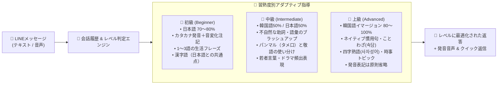

# 🇰🇷🇯🇵 KoreanTeacher_LINE

LINEで学べるAI韓国語学習パートナー＆ガイドボット！  
ソウル出身のネイティブ韓国語講師**「キム・ヒョンウ（김현우）」先生**が、まるで頼れる優しいお兄さん（ヒョン／オッパ）のように、チャットを通じて楽しく自然な韓国語会話をサポートします。

> 📖 [English README](./README.md) はこちら

---

## ✨ 主な特徴

- **👨‍🏫 キム・ヒョンウ先生（김현우）**
  - 日本が大好きなソウル出身の韓国語講師。生徒の小さな挑戦も全力で肯定し、褒めて伸ばすスタイルで楽しく会話できます。
- **🤝 人間らしい生きた対話＆オウム返し防止（Anti-Repetition）**
  - 生徒が同じ言葉や挨拶、質問を繰り返した場合でも、機械的に全く同じ解説や返答を繰り返すことはありません。
  - 生徒が習った表現をアウトプットした際には「대박! 早速使ってくれましたね！👏」と実践を全力で褒め、新しい例文やイントネーションのコツ、会話を広げるパスを投げかけます。
- **🎯 習熟度レベルに応じた最適化＆永続記憶**
  - 生徒の韓国語習熟度（`beginner`（初級）, `intermediate`（中級）, `advanced`（上級））を **Firestore** に永続記録し、返信言語の比率や解説の深さを動的に調整：
    - **初級 (Beginner)**: 日本語中心（70〜80%）、丁寧なカタカナ発音ヒント（連音化・音変化の注記付き）、基礎フレーズ、日本語との共通点（漢字語）を重視。
    - **中級 (Intermediate)**: 韓国語50%・日本語50%のバランス、ネイティブらしい自然な言い回しへのブラッシュアップ、パンマル（タメ口）と敬語の使い分け、若者言葉やドラマ頻出表現。
    - **上級 (Advanced)**: 韓国語イマージョン（80〜100%）、洗練されたネイティブ特有の慣用表現、ことわざ（속담）、四字熟語、時事トピック、発音ヒントは原則省略。
  - 「初心者です」「TOPIK4級です」といった自己申告はもちろん、日々のチャット内容から先生が自動で判定・更新します。
- **💬 機械的な添削・採点のない自然な会話**
  - 文法テストのような減点方式ではなく、ネイティブならではの自然なニュアンスや表現をリアクションの中に自然に織り交ぜて教えます。
- **✨ キーフレーズカード表示**
  - 会話に出てきた重要な韓国語フレーズを、カタカナ発音のヒント（連音化や濃音化などのポイント付き）と日本語訳を添えて分かりやすく提示します。
- **🔘 LINE クイック返信（Quick Reply）ボタン対応**
  - 毎回の返信に2〜4個のワンタップボタン（例: `[네, 맞아요!]`、`[タメ口では？]`、`[発音を聞かせて🔊]`）を自動生成。スマホでのハングル入力の手間を減らし、スムーズに会話を続けられます。
- **🗣️ 音声メッセージ＆オンデマンド発音再生**
  - ユーザーが送信したボイスメッセージ（LINE音声）を聴いてフィードバック。
  - 「発音を聞かせて🔊」ボタンのタップや「発音を聞かせて」というリクエストに応じて、ネイティブ音声（m4a）を即座に生成して返信します。
- **💡 日本語との共通点（漢字語）を活かしたアハ体験**
  - 韓国語の約70%を占める漢字語（約束 = 약속、無料 = 무료、カバン = 가방 など）を積極的に紹介し、日本人学習者が直感的に覚えられるよう導きます。
- **🔍 リアルタイム韓国トレンド・旅行情報検索**
  - Naver検索（ブログ・Web）、Kakao/Daum検索、Google検索と連携。最新のカフェ、グルメ、観光地、流行表現などをリアルタイムに検索して回答します。
- **🧠 永続的なユーザー記憶（Firestore連携）**
  - Google Cloud Firestoreを活用し、ユーザーごとの習熟度レベル・好み・学習目標・「敬語で話して」「初心者です」などのカスタム指示を自動で記憶・維持します。
- **☁️ サーバーレス＆クラウドネイティブ**
  - Google Cloud Run上でコンテナとして稼働。アイドル時はインスタンス数がゼロにスケールダウンするため、低コストで運用可能です。

---

## ⚙️ 技術スタック

| コンポーネント | 利用技術 | 役割 |
|---|---|---|
| **バックエンドフレームワーク** | [FastAPI](https://fastapi.tiangolo.com/) | 非同期Webhookルーティング、ヘルスチェック、音声ストリーミング |
| **生成AI** | [Google GenAI SDK](https://ai.google.dev/) (`gemini-3.8-flash`) | 会話生成、JSON構造化出力（Pydantic）、Function Callingツール実行 |
| **メッセージングプラットフォーム** | [LINE Messaging API SDK v3](https://developers.line.biz/ja/docs/messaging-api/) | Webhook検証、メッセージ送受信、クイック返信、音声メッセージ配信 |
| **データベース・記憶** | [Google Cloud Firestore](https://cloud.google.com/firestore) | 会話履歴の保持および永続的なユーザー指示・好みの保存 |
| **音声合成・変換** | [Google Cloud Text-to-Speech](https://cloud.google.com/text-to-speech) + `ffmpeg` | Neural2音声（`ko-KR-Neural2-C`, `ja-JP-Neural2-D`）の生成とAAC (`.m4a`) 変換 |
| **外部検索連携** | [Naver Developers](https://developers.naver.com/) & [Kakao Developers](https://developers.kakao.com/) | 韓国のWeb・ブログ・地域情報のリアルタイム取得 |
| **インフラ・コンテナ** | [Google Cloud Run](https://cloud.google.com/run) & Docker | フルマネージドのサーバーレスコンテナ実行環境 |

---

## 📱 システム画面プレビュー & 会話体験

### 1. LINEトーク画面イメージ（初級対応 & 練習リピートへの自然なリアクション）

```
┌────────────────────────────────────────────────────────┐
│ 🟢 LINEトーク: キム・ヒョンウ先生（김현우）             │
├────────────────────────────────────────────────────────┤
│                                                        │
│ [生徒] 👤                                              │
│ 今日めっちゃ疲れた〜                                   │
│                                                        │
│ 👨‍🏫 [ヒョヌ先生]                                       │
│ 今日もお疲れ様でした！本当によく頑張りましたね✨        │
│ 韓国語では『오늘 너무 피곤했어요~』って言います。     │
│ 温かいお風呂に入ってゆっくり休んでくださいね！         │
│ 明日は何時に起きる予定ですか？                         │
│                                                        │
│ ┌────────────────────────────────────────────────────┐ │
│ │ ✨ 今日のキー表現：                                │ │
│ │ 『 오늘 너무 피곤했어요 』                         │ │
│ │ 🗣️ 発音：オヌル ノム ピゴネッソヨ                   │ │
│ │ 🇯🇵 意味：今日すごく疲れました                       │ │
│ └────────────────────────────────────────────────────┘ │
│                                                        │
│ [生徒] 👤                                              │
│ 오늘 너무 피곤했어요                                   │
│                                                        │
│ 👨‍🏫 [ヒョヌ先生] （※オウム返しせず、練習を褒めて発展）│
│ 대박! 早速使ってくれましたね！👏 発音もバッチリ伝わって│
│ きます！友達同士のタメ口なら『오늘 너무 피곤했어』     │
│ って言えばOKですよ😊 今夜はぐっすり眠れそうですか？    │
│                                                        │
│ ┌────────────────────────────────────────────────────┐ │
│ │ 🔊 音声メッセージ (m4a) [▶ 0:02 / 0:02]            │ │
│ └────────────────────────────────────────────────────┘ │
│                                                        │
├────────────────────────────────────────────────────────┤
│ 💡 ワンタップ返信 (Quick Reply):                       │
│ [네! (はい!)]  [タメ口では？]  [発音を聞かせて🔊]      │
└────────────────────────────────────────────────────────┘
```

### 2. 生徒の習熟度レベルに応じた動的対応マップ



---

## 🏗️ アーキテクチャフロー


---

## 📁 ディレクトリ構成

```
KoreanTeacher_LINE/
├── app/
│   ├── __init__.py           # パッケージ初期化ファイル
│   ├── gemini_client.py      # Geminiモデル設定、ペルソナプロンプト、Firestore記憶機能、検索ツール
│   ├── main.py               # FastAPIアプリ、LINE Webhookハンドラー、TTSパイプライン、バックグラウンド処理
│   └── web_search.py         # Naver、Kakao、Googleカスタム検索の連携モジュール
├── docs/
│   └── naver_kakao_api_guide.md  # Naver & Kakao APIキー取得手順書
├── .dockerignore             # Dockerイメージビルド時の除外設定
├── .gcloudignore             # Cloud Buildパッケージング時の除外設定
├── .gitignore                # Git管理対象外設定 (.env, venv等)
├── deploy.ps1                # Cloud Run自動デプロイ用PowerShellスクリプト
├── Dockerfile                # Python 3.11-slim + ffmpeg 構成のコンテナ定義
├── README.md                 # 英語ドキュメント
├── README.ja.md              # 日本語ドキュメント（本ファイル）
└── requirements.txt          # Python依存ライブラリ一覧
```

主なファイル:
- [app/main.py](app/main.py): FastAPIのエンドポイント定義、LINE Webhook受信処理、音声ストリーミング
- [app/gemini_client.py](app/gemini_client.py): `gemini-3.8-flash` の設定、Pydanticレスポンスモデル、プロンプト、Firestore永続化
- [app/web_search.py](app/web_search.py): Naverブログ/Web、Kakaoブログ/Web、Googleカスタム検索の実行モジュール
- [docs/naver_kakao_api_guide.md](docs/naver_kakao_api_guide.md): NaverおよびKakaoの開発者登録とAPIキー取得方法の解説
- [deploy.ps1](deploy.ps1): Google Cloud Runへ自動デプロイするスクリプト
- [Dockerfile](Dockerfile): 非rootユーザー実行・ffmpeg導入済みの本番用コンテナ定義
- [requirements.txt](requirements.txt): 必要パッケージ一覧

---

## 🔌 APIエンドポイント

| エンドポイント | メソッド | 説明 |
|---|---|---|
| `/callback` | `POST` | LINE Messaging APIのWebhookエンドポイント。署名検証（`X-Line-Signature`）を行い、テキスト・音声・友だち追加/ブロック解除イベント等を処理します。 |
| `/health` | `GET` | 稼働確認・診断用エンドポイント。モデル名、Base URL、外部検索APIの設定有無を返します。 |
| `/audio/{filename}` | `GET` | 合成された `.m4a` 音声ファイルをLINEの `AudioMessage` 再生用に配信します。 |

---

## 🔑 環境変数一覧

`.env` ファイルをプロジェクト直下に作成して設定します。

| 環境変数名 | 必須 | デフォルト値 / 設定例 | 説明 |
|---|---|---|---|
| `LINE_CHANNEL_SECRET` | **必須** | `your_channel_secret` | LINE Developersで発行されたチャネルシークレット（Webhookの署名検証用） |
| `LINE_CHANNEL_ACCESS_TOKEN` | **必須** | `your_access_token` | LINE Developersで発行されたチャネルアクセストークン（長期） |
| `GEMINI_API_KEY` | **必須** | `your_gemini_key` | Google AI Studioで取得したGemini APIキー |
| `GOOGLE_CLOUD_PROJECT` | **必須** | `your_gcp_project_id` | FirestoreおよびGCPサービスの初期化に使用するGCPプロジェクトID |
| `BASE_URL` | 任意 | `https://your-service-url.run.app` | LINEが音声ファイルをダウンロードするための公開HTTPSベースURL |
| `GEMINI_MODEL` | 任意 | `gemini-3.8-flash` | 使用するGeminiモデル名 |
| `PORT` | 任意 | `8080` | Uvicornサーバーのリッスンポート（Cloud Run環境では自動設定） |
| `NAVER_CLIENT_ID` | 任意 | `your_naver_client_id` | Naver Search APIのクライアントID（韓国ローカル・ブログ検索用） |
| `NAVER_CLIENT_SECRET` | 任意 | `your_naver_client_secret` | Naver Search APIのクライアントシークレット |
| `KAKAO_REST_API_KEY` | 任意 | `your_kakao_rest_api_key` | Kakao Search REST APIキー（Daum検索用） |
| `GOOGLE_SEARCH_API_KEY` | 任意 | `your_google_key` | Google Custom Search APIキー（一般的なWeb検索用） |
| `GOOGLE_SEARCH_CX` | 任意 | `your_search_cx` | Google プログラマブル検索エンジンID |

> [!TIP]
> NaverおよびKakaoのAPIキー取得手順の詳細は [docs/naver_kakao_api_guide.md](docs/naver_kakao_api_guide.md) をご覧ください。未設定の場合でも自動的にスキップされ、チャット機能自体は問題なく動作します。

---

## 💻 ローカル環境構築

### 1. 前提条件

- **Python 3.11以上**
- **FFmpeg & FFprobe**（音声をAAC `.m4a` 形式に変換するために必須）
  - Windows: `winget install Gyan.FFmpeg` または `choco install ffmpeg`
  - macOS: `brew install ffmpeg`
  - Linux (Ubuntu/Debian): `sudo apt-get install -y ffmpeg`
- **Google Cloud SDK (`gcloud`)** のインストールと認証
  ```bash
  gcloud auth application-default login
  ```
- **LINE Messaging API チャネル**（LINE Developers Consoleで作成）

### 2. 仮想環境の作成と依存ライブラリ導入

```bash
# リポジトリのクローン
git clone https://github.com/your-username/KoreanTeacher_LINE.git
cd KoreanTeacher_LINE

# 仮想環境の作成
python -m venv venv

# 仮想環境の有効化 (Windows PowerShell)
.\venv\Scripts\Activate.ps1
# macOS / Linux の場合:
# source venv/bin/activate

# パッケージのインストール
pip install -r requirements.txt
```

### 3. ローカルサーバーの起動

```bash
uvicorn app.main:app --reload --host 0.0.0.0 --port 8000
```

起動後、ブラウザで `http://localhost:8000/health` にアクセスして動作を確認します。

### 4. ローカルでのLINE Webhook疎通テスト

LINE Webhookはインターネットからアクセス可能なHTTPS URLが必要です。

1. **ngrok** または **localtunnel** でトンネルを開通します:
   ```bash
   ngrok http 8000
   ```
2. `.env` の `BASE_URL` に取得したURLを設定します（例: `BASE_URL=https://xxxx.ngrok-free.app`）。
3. [LINE Developers Console](https://developers.line.biz/console/) にて:
   - **Webhook URL** に `https://xxxx.ngrok-free.app/callback` を登録し、「検証」をクリック
   - **Webhookの利用** を「オン」に設定
   - **LINE公式アカウントの機能** の「応答メッセージ」を「オフ」に設定（自動応答の重複を防ぐため）

---

## 🐳 Dockerでの実行

ローカルでDockerコンテナをビルド・起動できます:

```bash
# イメージのビルド
docker build -t korean-teacher-bot .

# コンテナの起動 (.env ファイルを渡す)
docker run -d --name korean-teacher-bot -p 8080:8080 --env-file .env korean-teacher-bot
```

---

## 🚀 Google Cloud Runへのデプロイ

付属の [deploy.ps1](deploy.ps1) スクリプトを使用して、ワンコマンドでGoogle Cloud Runにデプロイできます。

### 1. 必要なGCP APIの有効化

```bash
gcloud services enable \
    run.googleapis.com \
    firestore.googleapis.com \
    texttospeech.googleapis.com \
    artifactregistry.googleapis.com
```

### 2. PowerShellスクリプトでデプロイ

`.env` に記載された環境変数を自動で読み取り、東京リージョン（`asia-northeast1`）にデプロイします:

```powershell
.\deploy.ps1
```

### 3. LINE側のWebhook URL更新

デプロイ完了時に表示されるCloud RunのURL（例: `https://korean-teacher-bot-xxx.asia-northeast1.run.app`）をコピーし、LINE Developers Consoleの **Webhook URL** に `https://korean-teacher-bot-xxx.asia-northeast1.run.app/callback` を設定してください。

---

## 🤝 コントリビューション

改善や機能追加のご提案をお待ちしています！
- プロンプトの改善や新しい学習シチュエーションの追加 ([app/gemini_client.py](app/gemini_client.py))
- 検索プロバイダーや文化情報の追加 ([app/web_search.py](app/web_search.py))
- 音声品質や応答UIの改善

IssueまたはPull Requestでお気軽にご参加ください。