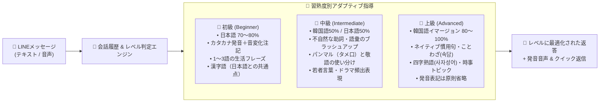
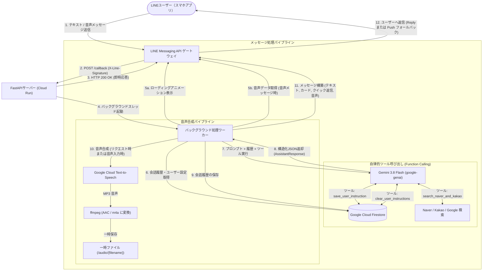

# 🇰🇷🇯🇵 KoreanTeacher_LINE

LINEで学べるAI韓国語学習パートナー＆ガイドボット！  
ソウル出身のネイティブ韓国語講師**「キム・ヒョンウ（김현우）」先生**が、まるで頼れる優しいお兄さん（ヒョン／オッパ）のように、チャットを通じて楽しく自然な韓国語会話をサポートします。

> 📖 [English README](./README.md) はこちら

---

## ✨ 主な特徴

- **👨‍🏫 キム・ヒョンウ先生（김현우）**
  - 日本が大好きなソウル出身の韓国語講師。生徒の小さな挑戦も全力で肯定し、褒めて伸ばすスタイルで楽しく会話できます。
- **🤝 人間らしい生きた対話＆オウム返し防止（Anti-Repetition）**
  - 生徒が同じ言葉や挨拶、質問を繰り返した場合でも、機械的に全く同じ解説や返答を繰り返すことはありません。
  - 生徒が習った表現をアウトプットした際には「대박! 早速使ってくれましたね！👏」と実践を全力で褒め、新しい例文やイントネーションのコツ、会話を広げるパスを投げかけます。
- **🎯 習熟度レベルに応じた最適化＆永続記憶**
  - 生徒の韓国語習熟度（`beginner`（初級）, `intermediate`（中級）, `advanced`（上級））を **Firestore** に永続記録し、返信言語の比率や解説の深さを動的に調整：
    - **初級 (Beginner)**: 日本語中心（70〜80%）、丁寧なカタカナ発音ヒント（連音化・音変化の注記付き）、基礎フレーズ、日本語との共通点（漢字語）を重視。
    - **中級 (Intermediate)**: 韓国語50%・日本語50%のバランス、ネイティブらしい自然な言い回しへのブラッシュアップ、パンマル（タメ口）と敬語の使い分け、若者言葉やドラマ頻出表現。
    - **上級 (Advanced)**: 韓国語イマージョン（80〜100%）、洗練されたネイティブ特有の慣用表現、ことわざ（속담）、四字熟語、時事トピック、発音ヒントは原則省略。
  - 「初心者です」「TOPIK4級です」といった自己申告はもちろん、日々のチャット内容から先生が自動で判定・更新します。
- **💬 機械的な添削・採点のない自然な会話**
  - 文法テストのような減点方式ではなく、ネイティブならではの自然なニュアンスや表現をリアクションの中に自然に織り交ぜて教えます。
- **✨ キーフレーズカード表示**
  - 会話に出てきた重要な韓国語フレーズを、カタカナ発音のヒント（連音化や濃音化などのポイント付き）と日本語訳を添えて分かりやすく提示します。
- **🔘 LINE クイック返信（Quick Reply）ボタン対応**
  - 毎回の返信に2〜4個のワンタップボタン（例: `[네, 맞아요!]`、`[タメ口では？]`、`[発音を聞かせて🔊]`）を自動生成。スマホでのハングル入力の手間を減らし、スムーズに会話を続けられます。
- **🗣️ 音声メッセージ＆オンデマンド発音再生**
  - ユーザーが送信したボイスメッセージ（LINE音声）を聴いてフィードバック。
  - 「発音を聞かせて🔊」ボタンのタップや「発音を聞かせて」というリクエストに応じて、ネイティブ音声（m4a）を即座に生成して返信します。
- **💡 日本語との共通点（漢字語）を活かしたアハ体験**
  - 韓国語の約70%を占める漢字語（約束 = 약속、無料 = 무료、カバン = 가방 など）を積極的に紹介し、日本人学習者が直感的に覚えられるよう導きます。
- **🔍 リアルタイム韓国トレンド・旅行情報検索**
  - Naver検索（ブログ・Web）、Kakao/Daum検索、Google検索と連携。最新のカフェ、グルメ、観光地、流行表現などをリアルタイムに検索して回答します。
- **🧠 短期＆長期記憶アーキテクチャ（Firestore連携）**
  - **短期コンテキスト**: 直近12ターン（6往復）のスライディングウィンドウをGeminiの会話コンテキストへ動的に供給。会話の流れを把握し、習った表現のアウトプットや繰り返し発話へ自然に対応。
  - **長期記憶**: 生徒の習熟度レベル（初級/中級/上級）に加え、呼び名や学習目的、好きなアイドル、会話の好み（「敬語で」「パンマルで」など）をFirestoreに永続保存。セッションを跨いで常に指導指針へ反映。
- **☁️ サーバーレス＆クラウドネイティブ**
  - Google Cloud Run上でコンテナとして稼働。アイドル時はインスタンス数がゼロにスケールダウンするため、低コストで運用可能です。

---

## ⚙️ 技術スタック

| コンポーネント | 利用技術 | 役割 |
|---|---|---|
| **バックエンドフレームワーク** | [FastAPI](https://fastapi.tiangolo.com/) | 非同期Webhookルーティング、ヘルスチェック、音声ストリーミング |
| **生成AI** | [Google GenAI SDK](https://ai.google.dev/) (`gemini-3.8-flash`) | 会話生成、JSON構造化出力（Pydantic）、Function Callingツール実行 |
| **メッセージングプラットフォーム** | [LINE Messaging API SDK v3](https://developers.line.biz/ja/docs/messaging-api/) | Webhook検証、メッセージ送受信、クイック返信、音声メッセージ配信 |
| **データベース・記憶** | [Google Cloud Firestore](https://cloud.google.com/firestore) | 会話履歴の保持および永続的なユーザー指示・好みの保存 |
| **音声合成・変換** | [Google Cloud Text-to-Speech](https://cloud.google.com/text-to-speech) + `ffmpeg` | Neural2音声（`ko-KR-Neural2-C`, `ja-JP-Neural2-D`）の生成とAAC (`.m4a`) 変換 |
| **外部検索連携** | [Naver Developers](https://developers.naver.com/) & [Kakao Developers](https://developers.kakao.com/) | 韓国のWeb・ブログ・地域情報のリアルタイム取得 |
| **インフラ・コンテナ** | [Google Cloud Run](https://cloud.google.com/run) & Docker | フルマネージドのサーバーレスコンテナ実行環境 |

---

## 📱 システム画面プレビュー & 会話体験

### 1. LINEトーク画面イメージ（初級対応 & 練習リピートへの自然なリアクション）

```
┌────────────────────────────────────────────────────────┐
│ 🟢 LINEトーク: キム・ヒョンウ先生（김현우）             │
├────────────────────────────────────────────────────────┤
│                                                        │
│ [生徒] 👤                                              │
│ 今日めっちゃ疲れた〜                                   │
│                                                        │
│ 👨‍🏫 [ヒョヌ先生]                                       │
│ 今日もお疲れ様でした！本当によく頑張りましたね✨        │
│ 韓国語では『오늘 너무 피곤했어요~』って言います。     │
│ 温かいお風呂に入ってゆっくり休んでくださいね！         │
│ 明日は何時に起きる予定ですか？                         │
│                                                        │
│ ┌────────────────────────────────────────────────────┐ │
│ │ ✨ 今日のキー表現：                                │ │
│ │ 『 오늘 너무 피곤했어요 』                         │ │
│ │ 🗣️ 発音：オヌル ノム ピゴネッソヨ                   │ │
│ │ 🇯🇵 意味：今日すごく疲れました                       │ │
│ └────────────────────────────────────────────────────┘ │
│                                                        │
│ [生徒] 👤                                              │
│ 오늘 너무 피곤했어요                                   │
│                                                        │
│ 👨‍🏫 [ヒョヌ先生] （※オウム返しせず、練習を褒めて発展）│
│ 대박! 早速使ってくれましたね！👏 発音もバッチリ伝わって│
│ きます！友達同士のタメ口なら『오늘 너무 피곤했어』     │
│ って言えばOKですよ😊 今夜はぐっすり眠れそうですか？    │
│                                                        │
│ ┌────────────────────────────────────────────────────┐ │
│ │ 🔊 音声メッセージ (m4a) [▶ 0:02 / 0:02]            │ │
│ └────────────────────────────────────────────────────┘ │
│                                                        │
├────────────────────────────────────────────────────────┤
│ 💡 ワンタップ返信 (Quick Reply):                       │
│ [네! (はい!)]  [タメ口では？]  [発音を聞かせて🔊]      │
└────────────────────────────────────────────────────────┘
```

### 2. 生徒の習熟度レベルに応じた動的対応マップ



---

## 🏗️ アーキテクチャフロー



---

## 📁 ディレクトリ構成

```
KoreanTeacher_LINE/
├── app/
│   ├── __init__.py               # パッケージ初期化ファイル
│   ├── config.py                 # マルチPC設定管理・Secret Manager解決モジュール
│   ├── gemini_client.py          # Geminiモデル設定、ペルソナプロンプト、Firestore記憶機能、検索ツール
│   ├── main.py                   # FastAPIアプリ、LINE Webhookハンドラー、TTSパイプライン、バックグラウンド処理
│   ├── memory.py                 # 2層GCSステート永続化・分離監査ログモジュール
│   └── web_search.py             # Naver、Kakao、Googleカスタム検索の連携モジュール
├── docs/
│   └── naver_kakao_api_guide.md  # Naver & Kakao APIキー取得手順書
├── scripts/
│   ├── deploy.ps1                # Cloud Run自動デプロイ用PowerShellスクリプト
│   └── sync_secrets.py           # マルチPCシークレット同期・GCS初期化スクリプト
├── .dockerignore                 # Dockerイメージビルド時の除外設定
├── .env.example                  # 環境変数テンプレート・設定リファレンス
├── .gcloudignore                 # Cloud Buildパッケージング時の除外設定
├── .gitignore                    # Git管理対象外設定 (.env, venv等)
├── Dockerfile                    # Python 3.11-slim + ffmpeg 構成のコンテナ定義
├── README.md                     # 英語ドキュメント
├── README.ja.md                  # 日本語ドキュメント（本ファイル）
└── requirements.txt              # Python依存ライブラリ一覧
```

主なファイル:
- [app/main.py](app/main.py): FastAPIのエンドポイント定義、LINE Webhook受信処理、音声ストリーミング
- [app/config.py](app/config.py): Secret Manager SDK、`gcloud` CLI、環境変数を透過的にフォールバック解決するデュアルモード設定管理
- [app/gemini_client.py](app/gemini_client.py): `gemini-3.8-flash` の設定、Pydanticレスポンスモデル、プロンプト、Firestore永続化
- [app/memory.py](app/memory.py): Google Cloud Storage を用いた2層ステート永続化とCloud Logging向け構造化ログ出力
- [app/web_search.py](app/web_search.py): Naverブログ/Web、Kakaoブログ/Web、Googleカスタム検索の実行モジュール
- [docs/naver_kakao_api_guide.md](docs/naver_kakao_api_guide.md): NaverおよびKakaoの開発者登録とAPIキー取得方法の解説
- [scripts/deploy.ps1](scripts/deploy.ps1): Google Cloud Runへ自動デプロイするスクリプト
- [scripts/sync_secrets.py](scripts/sync_secrets.py): マルチPCシークレット同期およびゼロセットアップ診断ツール
- [Dockerfile](Dockerfile): 非rootユーザー実行・ffmpeg導入済みの本番用コンテナ定義
- [requirements.txt](requirements.txt): 必要パッケージ一覧

---

## 🔌 APIエンドポイント

| エンドポイント | メソッド | 説明 |
|---|---|---|
| `/callback` | `POST` | LINE Messaging APIのWebhookエンドポイント。署名検証（`X-Line-Signature`）を行い、テキスト・音声・友だち追加/ブロック解除イベント等を処理します。 |
| `/health` | `GET` | 稼働確認・診断用エンドポイント。モデル名、Base URL、外部検索APIの設定有無を返します。 |
| `/audio/{filename}` | `GET` | 合成された `.m4a` 音声ファイルをLINEの `AudioMessage` 再生用に配信します。 |

---

## 🧠 メモリアーキテクチャ（短期記憶と長期記憶）

長期的な学習パートナーとしての価値を最大化するため、ユーザーID単位で2層のメモリシステムを備えています：

| 種別 | 範囲・保存先 | 仕組み・動作 |
|---|---|---|
| **短期コンテキスト** | 会話ターン（Firestore / メモリキャッシュ） | 直近**12ターン（6往復分）**をスライディングウィンドウとしてGeminiの会話コンテキストへ動的に供給します。前後の文脈を把握し、習った表現の練習（即時称賛）や同じ発話の繰り返し（切り口を変えた展開）を検知します。 |
| **長期記憶** | 永続プロファイル（Firestore） | 生徒の**習熟度レベル**（`beginner`, `intermediate`, `advanced`）と、明示的な**カスタム指示・好み**（呼び名、学習目標、好きなK-POPグループ、話し方の希望など）をFirestoreに永続保存します。日を跨いだセッションでもシステムプロンプトに常時注入されます。 |

*※プライバシー配慮：ユーザーがボットをブロックまたは友達解除（Unfollow）した際、保存された履歴やプロファイルは自動的にFirestoreから完全削除されます。*

---

## ☁️ マルチPC対応 クラウドネイティブ・アーキテクチャ

KoreanTeacher_LINE は、ローカルPC（Windows/macOS/Linux）やGoogle Cloud Runコンテナ環境を問わず、ゼロセットアップで即座に動作するポータブルアーキテクチャを採用しています：

```
+-----------------------------------------------------------------------------------+
| 複数台のローカルPC (Windows/Mac/Linux)          Cloud Run 本番コンテナ環境        |
| (`gcloud auth login` 認証済み)                  (Compute Engine デフォルトSA)     |
+-----------------------------------------------------------------------------------+
                                         |
                                         v
               +---------------------------------------------------+
               | デュアルモード設定マネージャー (app/config.py)     |
               | 1. Secret Manager Python SDK (ADC認証)            |
               | 2. gcloud CLI フォールバック (`secrets versions`) |
               | 3. OS一時ディレクトリ / 環境変数フォールバック    |
               +---------------------------------------------------+
                                         |
            +----------------------------+----------------------------+
            |                                                         |
            v                                                         v
+-------------------------------+                         +-------------------------------+
| Google Cloud Secret Manager   |                         | Google Cloud Storage (GCS)    |
| - gemini-api-key              |                         | - 永続ステート / プロファイル |
| - korean-teacher-line-channel |                         |   gs://<bucket>/korean_teacher|
|   -secret / -access-token     |                         |   /user_cache.json            |
| - naver / kakao / 検索キー    |                         | - 分離された実行・監査ログ    |
+-------------------------------+                         |   gs://<bucket>/korean_teacher|
                                                          |   /run_log.json               |
                                                          +-------------------------------+
```

### 1. クラウドシークレット解決（ゼロセットアップ）
ローカルに `.env` や認証トークンファイルを一切配置する必要がありません。
1. アプリ起動時に **Google Cloud Secret Manager** から自動的にキーを解決します。
2. ローカルのADC（Application Default Credentials）が未設定の場合でも、ログイン済みの `gcloud` CLI 経由でシームレスにフォールバック取得します。
3. 取得した値はメモリ内に安全にキャッシュされるため、毎回のAPI呼び出しオーバーヘッドはありません。

### 2. ステートとメモリのクラウド移行（Cloud Storage）
- ユーザーの学習プロファイルや指示のキャッシュは **Google Cloud Storage** (`gs://<project_id>-korean-teacher-data/korean_teacher/`) を真実のソースとして永続化されます。
- ローカル実行時のキャッシュはOSの一時ディレクトリ（`tempfile.gettempdir()`）に保存され、Gitリポジトリルートを**一切汚染しません**。

### 3. 実行ログ・監査ログの完全分離
- 会話ステートとシステムの運用ログ（実行時間、タイムスタンプ、エラー詳細）は完全に分離されています。
- 運用ログは GCS（`run_log.json`）に蓄積されると同時に構造化JSONとして `stdout` に出力され、**Google Cloud Logging** に自動収集されます。

---

## 🔑 設定項目と Secret Manager キー名

| 設定項目 | Secret Manager ID | 環境変数フォールバック | 説明 |
|---|---|---|---|
| Gemini API キー | `gemini-api-key` | `GEMINI_API_KEY` | モデル推論用 Gemini API キー |
| LINE チャネルシークレット | `korean-teacher-line-channel-secret` | `LINE_CHANNEL_SECRET` | LINE Webhook 署名検証用チャネルシークレット |
| LINE アクセストークン | `korean-teacher-line-channel-access-token` | `LINE_CHANNEL_ACCESS_TOKEN` | 返信送信用の長期チャネルアクセストークン |
| GCP プロジェクト ID | — | `GOOGLE_CLOUD_PROJECT` | GCP プロジェクト ID（未指定時は `gcloud` から自動検出） |
| GCS バケット名 | `korean-teacher-bucket-name` | `GCS_BUCKET_NAME` | Cloud Storage バケット名（デフォルト: `<project-id>-korean-teacher-data`） |
| 公開ベース URL | — | `BASE_URL` | 音声ファイル配信用 Cloud Run 公開 URL |
| Naver 検索（任意）| `naver-client-id`, `naver-client-secret` | `NAVER_CLIENT_ID`, `NAVER_CLIENT_SECRET` | 韓国ローカル情報・ブログ検索用キー |
| Kakao 検索（任意）| `kakao-rest-api-key` | `KAKAO_REST_API_KEY` | Daum Web・ブログ検索用 REST API キー |
| Google カスタム検索（任意）| `google-search-api-key`, `google-search-cx` | `GOOGLE_SEARCH_API_KEY`, `GOOGLE_SEARCH_CX` | Google Custom Search API キーおよびエンジン ID |

---

## 🛠️ マルチPC管理ツール (`scripts/sync_secrets.py`)

同梱の [scripts/sync_secrets.py](scripts/sync_secrets.py) スクリプトにより、どのマシンからでもクラウド連携のテストやシークレット登録が行えます：

```bash
# 1. ゼロセットアップ疎通確認（Secret Manager および GCS へのアクセスをドライラン検証）
python scripts/sync_secrets.py --dry-run

# 2. Cloud Storage バケットの自動作成・確認
python scripts/sync_secrets.py --init-bucket

# 3. ローカルの .env の値を Secret Manager に一括登録（必要時のみ）
python scripts/sync_secrets.py --push-env .env
```

---

## 💻 ローカル環境での実行

### 1. 前提条件

- **Python 3.11以上**
- **FFmpeg & FFprobe**
- **Google Cloud SDK (`gcloud`)** ログイン済み:
  ```bash
  gcloud auth login
  gcloud config set project <YOUR_PROJECT_ID>
  ```

### 2. ライブラリ導入

```bash
pip install -r requirements.txt
```

### 3. クラウド疎通確認と起動

```bash
# クラウド接続確認
python scripts/sync_secrets.py --dry-run

# ローカルサーバー起動
uvicorn app.main:app --reload --host 0.0.0.0 --port 8000
```

---

## 🚀 Google Cloud Run へのデプロイ

[scripts/deploy.ps1](scripts/deploy.ps1) スクリプトを使用して、東京リージョン（`asia-northeast1`）に安全にデプロイできます：

```powershell
# Cloud Run へデプロイ
.\scripts\deploy.ps1
```

※Cloud Run 上ではサービスアカウントの IAM 権限によって Secret Manager や Cloud Storage に安全に接続するため、環境変数に生パスワードやシークレットを埋め込む必要はありません。

---

## 🤝 コントリビューション

改善や機能追加のご提案をお待ちしています！
- プロンプトの改善や新しい学習シチュエーションの追加 ([app/gemini_client.py](app/gemini_client.py))
- 検索プロバイダーや文化情報の追加 ([app/web_search.py](app/web_search.py))
- 音声品質や応答UIの改善

IssueまたはPull Requestでお気軽にご参加ください。