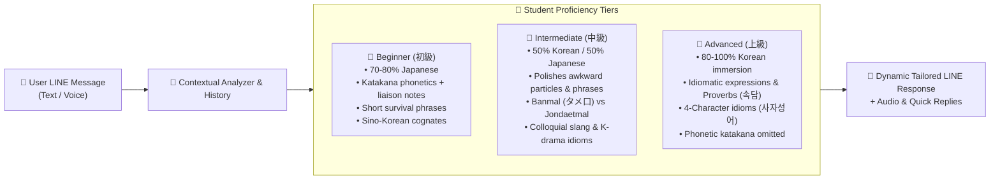
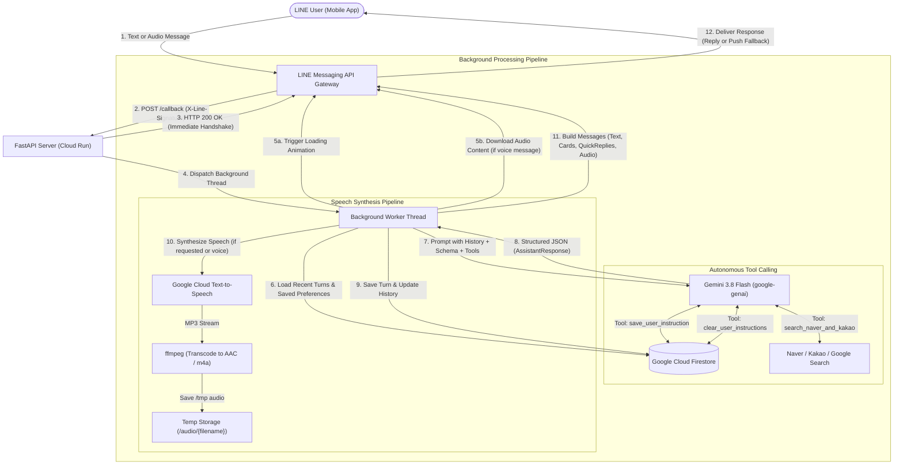

# 🇰🇷🇯🇵 KoreanTeacher_LINE

An AI-powered interactive Korean learning partner and friendly guide built natively for LINE! Mentored by **Teacher Kim Hyun-woo (김현우)**, this bot helps Japanese learners speak and understand Korean effortlessly and with fun—just like chatting with a warm, encouraging native Korean friend and teacher.

> 📖 [日本語版 README (Japanese version)](./README.ja.md)

---

## ✨ Features

- **👨‍🏫 Teacher Kim Hyun-woo (김현우)**
  - A friendly, encouraging native Korean teacher from Seoul who loves Japan. Acts like a supportive older brother (ヒョヌ/オッパ) who celebrates your progress and chats naturally.
- **🤝 Dynamic Human-Like Conversation & Anti-Repetition**
  - Truly conversational and alive: never outputs identical canned explanations or duplicate phrase cards when the user repeats the same input or greeting.
  - Recognizes repeated practice ("대박! You used the phrase right away!👏") and provides fresh variations, nuanced tips, or moves the dialogue forward naturally.
- **🎯 Persistent Proficiency Level Adaptation**
  - Remembers each user's proficiency level (`beginner`, `intermediate`, `advanced`) in **Firestore** and dynamically adjusts tone, language ratio, and depth:
    - **Beginner (初級)**: ~80% Japanese, friendly Katakana phonetic hints (liaison/sound change notes), high-frequency survival phrases, Sino-Korean cognates.
    - **Intermediate (中級)**: 50/50 Korean/Japanese blend, natural native collocations, polishes awkward particles, deep dive into 반말 (informal) vs 존댓말 (polite) nuances and trending slang.
    - **Advanced (上級)**: 80–100% Korean immersion, idiomatic expressions, proverbs (속담), four-character idioms (사자성어), cultural and trending topics; Katakana hints omitted.
  - Automatically infers proficiency from user inputs or respects explicit declarations ("I am a beginner", "I have TOPIK level 5").
- **💬 Natural Conversational Immersion (No Robotic Grading)**
  - Replaces rigid "grading/error reports" with organic, supportive conversation. Corrections and natural native nuances are seamlessly woven into chat reactions.
- **✨ Structured Korean Expression Cards**
  - When learning or chatting, key Korean phrases are highlighted with Japanese Katakana pronunciation hints (covering liaison/sound changes) and clear translations.
- **🔘 Interactive LINE Quick Reply Buttons**
  - Provides 2–4 dynamic one-tap buttons with every message (e.g. `[네, 맞아요!]`, `[タメ口では？]`, `[発音を聞かせて🔊]`), removing the friction of typing Hangul on mobile.
- **🗣️ Adaptive & On-Demand Audio Pronunciation**
  - Listens to student voice messages and provides warm spoken feedback.
  - Generates native Korean audio on demand whenever the learner taps `[発音を聞かせて🔊]` or asks to hear pronunciation.
- **💡 "Kanji-go / Cognate" Aha Moments**
  - Actively leverages the ~70% shared Sino-Korean vocabulary (e.g. 약속 = 約束, 무료 = 無料) to build immediate confidence for Japanese speakers.
- **🔍 Real-Time Korean Trend & Travel Search**
  - Uses custom function calling tools integrated with Naver Search (Blog & Web), Kakao/Daum Search, and Google Custom Search to provide accurate, up-to-date recommendations for cafes, restaurants, tourist spots, and slang.
- **🧠 Short-Term & Long-Term Memory Architecture**
  - **Short-Term Context**: Retains recent turns per user (sliding window of 12 turns / 6 message pairs injected into active Gemini chat context) to maintain fluid dialogue continuity, recognize repeated practice, and prevent canned answers.
  - **Long-Term Memory**: Automatically persists user proficiency levels and explicitly saves custom instructions/preferences (e.g. learning goals, nicknames, favorite idols) to **Google Cloud Firestore**, restoring them seamlessly across sessions.
- **☁️ Serverless Cloud Native**
  - Container-based execution architected for **Google Cloud Run**, providing scalable deployments that scale to zero when inactive.

---

## ⚙️ Core Technology Stack

| Component | Technology | Role |
|---|---|---|
| **Backend Framework** | [FastAPI](https://fastapi.tiangolo.com/) | Asynchronous webhook routing, health checks, and audio streaming |
| **Generative AI** | [Google GenAI SDK](https://ai.google.dev/) (`gemini-3.8-flash`) | Contextual conversation, JSON schema enforcement, and tool execution |
| **Messaging Platform** | [LINE Messaging API SDK v3](https://developers.line.biz/en/docs/messaging-api/) | Webhook parsing, rich text cards, audio messages, and quick reply actions |
| **Database & Memory** | [Google Cloud Firestore](https://cloud.google.com/firestore) | Contextual history preservation and persistent user preferences |
| **Speech & Audio** | [Google Cloud Text-to-Speech](https://cloud.google.com/text-to-speech) + `ffmpeg` | Neural2 speech synthesis (`ko-KR-Neural2-C` & `ja-JP-Neural2-D`) and AAC conversion |
| **Search Integrations** | [Naver Developers](https://developers.naver.com/) & [Kakao Developers](https://developers.kakao.com/) | Real-time Korean web, blog, and local info retrieval |
| **Hosting & Container** | [Google Cloud Run](https://cloud.google.com/run) & Docker | Fully managed serverless container runtime |

---

## 📱 Visual System & User Experience Preview

### 1. Interactive LINE Chat Experience (Beginner & Repetition Handling)

```
┌────────────────────────────────────────────────────────┐
│ 🟢 LINE Chat: Kim Hyun-woo (キム・ヒョンウ先生)        │
├────────────────────────────────────────────────────────┤
│                                                        │
│ [Student] 👤                                          │
│ 今日めっちゃ疲れた〜                                   │
│                                                        │
│ 👨‍🏫 [Teacher Kim]                                      │
│ 今日もお疲れ様でした！本当によく頑張りましたね✨        │
│ 韓国語では『오늘 너무 피곤했어요~』って言います。     │
│ 温かいお風呂に入ってゆっくり休んでくださいね！         │
│ 明日は何時に起きる予定ですか？                         │
│                                                        │
│ ┌────────────────────────────────────────────────────┐ │
│ │ ✨ 今日のキー表現：                                │ │
│ │ 『 오늘 너무 피곤했어요 』                         │ │
│ │ 🗣️ 発音：オヌル ノム ピゴネッソヨ                   │ │
│ │ 🇯🇵 意味：今日すごく疲れました                       │ │
│ └────────────────────────────────────────────────────┘ │
│                                                        │
│ [Student] 👤                                          │
│ 오늘 너무 피곤했어요                                   │
│                                                        │
│ 👨‍🏫 [Teacher Kim]                                      │
│ 대박! 早速使ってくれましたね！👏 発音もバッチリ伝わって│
│ きます！友達同士のタメ口なら『오늘 너무 피곤했어』     │
│ って末尾を軽く言えばOKですよ😊 今夜はぐっすり眠れそう? │
│                                                        │
│ ┌────────────────────────────────────────────────────┐ │
│ │ 🔊 音声メッセージ (m4a) [▶ 0:02 / 0:02]            │ │
│ └────────────────────────────────────────────────────┘ │
│                                                        │
├────────────────────────────────────────────────────────┤
│ 💡 Quick Replies:                                      │
│ [네! (はい!)]  [タメ口では？]  [発音を聞かせて🔊]      │
└────────────────────────────────────────────────────────┘
```

### 2. Multi-Level Proficiency Adaptive Behavior



---

## 🏗️ Architecture & Data Flow



---

## 📁 Project Structure

Curated workspace directory structure highlighting key files and components:

```
KoreanTeacher_LINE/
├── app/
│   ├── __init__.py           # Package marker
│   ├── gemini_client.py      # Gemini model configuration, persona prompt, Firestore memory & tools
│   ├── main.py               # FastAPI application, LINE webhook handlers, TTS pipeline & background jobs
│   └── web_search.py         # Naver, Kakao, and Google Custom Search integration modules
├── docs/
│   └── naver_kakao_api_guide.md  # Setup walkthrough for obtaining Naver and Kakao API keys
├── .dockerignore             # Excludes unnecessary build artifacts from Docker image
├── .gcloudignore             # Excludes files from Cloud Build packaging
├── .gitignore                # Git hygiene configuration
├── deploy.ps1                # Automated Cloud Run build and deployment PowerShell script
├── Dockerfile                # Production container specification with Python 3.11-slim & ffmpeg
├── README.md                 # Project documentation and architectural guide
└── requirements.txt          # Python dependencies
```

Key workspace files:
- [app/main.py](app/main.py): Entry point containing FastAPI routes, LINE webhook handlers, and audio streaming endpoints.
- [app/gemini_client.py](app/gemini_client.py): Core AI logic configuring `gemini-3.8-flash`, Pydantic response models, system prompt, and Firestore persistence.
- [app/web_search.py](app/web_search.py): Autonomous search tools for Naver Blog/Webkr, Kakao Web/Blog, and Google Custom Search.
- [docs/naver_kakao_api_guide.md](docs/naver_kakao_api_guide.md): Guide for registering applications and obtaining Naver & Kakao API keys.
- [deploy.ps1](deploy.ps1): Automated deployment script to Google Cloud Run.
- [Dockerfile](Dockerfile): Production container specification with non-root security and `ffmpeg` support.
- [requirements.txt](requirements.txt): Application dependencies list.

---

## 🔌 API Endpoints Summary

| Endpoint | Method | Description |
|---|---|---|
| `/callback` | `POST` | LINE Messaging API webhook endpoint. Validates signature (`X-Line-Signature`) and handles text, audio, unfollow, and room leave events. |
| `/health` | `GET` | Health check and diagnostics endpoint. Returns service status, active Gemini model, base URL, and search integration statuses. |
| `/audio/{filename}` | `GET` | Serves synthesized `.m4a` speech files for LINE `AudioMessage` playback. |

---

## 🧠 Memory Architecture (Short-Term & Long-Term)

To ensure personalized, high-value learning over extended periods, the bot incorporates a dual-tier memory system per user ID:

| Tier | Scope & Storage | How It Works |
|---|---|---|
| **Short-Term Context** | In-flight turns (Firestore / Cache) | Keeps a sliding window of the **12 most recent turns (6 conversational exchanges)** directly in the active Gemini context. Evaluates dialogue flow to detect whether the user is repeating a message (triggering alternative phrasing) or practicing a taught expression (triggering praise). |
| **Long-Term Memory** | Permanent user profile (Firestore) | Persists the user's **proficiency level** (`beginner`, `intermediate`, `advanced`) and explicit **custom preferences/instructions** (e.g., nicknames, learning goals, favorite artists, speech preferences). These are injected into the system instruction on every turn across all sessions. |

*Privacy note: If a user unfollows or blocks the bot, their stored chat history and profile are automatically purged from Firestore.*

---

## 🔑 Environment Variables

The application is configured using environment variables. Create a local `.env` file in the project root:

| Variable | Required | Default / Example | Description |
|---|---|---|---|
| `LINE_CHANNEL_SECRET` | **Yes** | `your_channel_secret` | LINE Messaging API Channel Secret for webhook signature verification. |
| `LINE_CHANNEL_ACCESS_TOKEN` | **Yes** | `your_access_token` | LINE Messaging API Channel Access Token (long-lived) for sending replies. |
| `GEMINI_API_KEY` | **Yes** | `your_gemini_key` | Google Gemini API Key for model inference. |
| `GOOGLE_CLOUD_PROJECT` | **Yes** | `your_gcp_project_id` | GCP Project ID used to initialize Firestore and Cloud Run. |
| `BASE_URL` | No | `https://korean-teacher-bot-...run.app` | Public HTTPS base URL used to construct publicly accessible audio links for LINE `AudioMessage`. |
| `GEMINI_MODEL` | No | `gemini-3.8-flash` | Gemini model name used for conversations. |
| `PORT` | No | `8080` | Port for the Uvicorn web server (automatically configured by Cloud Run). |
| `NAVER_CLIENT_ID` | Optional | `your_naver_client_id` | Naver Search API Client ID for querying Naver Korean Blog & Web results. |
| `NAVER_CLIENT_SECRET` | Optional | `your_naver_client_secret` | Naver Search API Client Secret. |
| `KAKAO_REST_API_KEY` | Optional | `your_kakao_rest_api_key` | Kakao Search REST API Key for querying Daum Korean Web & Blog results. |
| `GOOGLE_SEARCH_API_KEY` | Optional | `your_google_search_key` | Google Custom Search API Key for broader web search. |
| `GOOGLE_SEARCH_CX` | Optional | `your_search_engine_cx` | Google Custom Search Engine ID (`cx`). |

> [!TIP]
> For instructions on getting search API keys, consult the detailed guide in [docs/naver_kakao_api_guide.md](docs/naver_kakao_api_guide.md). If omitted, search operations fall back gracefully.

---

## 💻 Local Development Setup

### 1. Prerequisites

- **Python 3.11+** installed on your machine.
- **FFmpeg & FFprobe** installed and available in your system `PATH` (required for audio conversion to AAC `.m4a` format).
  - Windows: `winget install Gyan.FFmpeg` or `choco install ffmpeg`
  - macOS: `brew install ffmpeg`
  - Linux (Debian/Ubuntu): `sudo apt-get install -y ffmpeg`
- **Google Cloud CLI (`gcloud`)** authenticated:
  ```bash
  gcloud auth application-default login
  ```
- **LINE Developer Account** with a Messaging API channel.

### 2. Virtual Environment & Dependencies

```bash
# Clone the repository and enter the directory
git clone https://github.com/your-username/KoreanTeacher_LINE.git
cd KoreanTeacher_LINE

# Create virtual environment
python -m venv venv

# Activate virtual environment
# Windows (PowerShell):
.\venv\Scripts\Activate.ps1
# macOS/Linux:
source venv/bin/activate

# Install dependencies
pip install -r requirements.txt
```

### 3. Running Locally

Start the local development server with auto-reload:

```bash
uvicorn app.main:app --reload --host 0.0.0.0 --port 8000
```

Verify that the server is running by opening `http://localhost:8000/health` in your browser.

### 4. Testing LINE Webhooks Locally

LINE requires a publicly reachable HTTPS webhook URL:

1. Launch a tunnel with [ngrok](https://ngrok.com/) or [localtunnel](https://localtunnel.github.io/www/):
   ```bash
   ngrok http 8000
   ```
2. Set `BASE_URL` in your `.env` to your public ngrok domain (e.g. `BASE_URL=https://abc123.ngrok-free.app`).
3. In the [LINE Developers Console](https://developers.line.biz/console/):
   - Set **Webhook URL** to `https://abc123.ngrok-free.app/callback`.
   - Click **Verify** to confirm connectivity.
   - Enable **Use webhook**.
   - Under **LINE Official Account features**, disable **Auto-reply messages** to avoid conflicting responses.

---

## 🐳 Docker Deployment

You can build and run the production container locally using Docker:

```bash
# Build the Docker image
docker build -t korean-teacher-bot .

# Run the container with your .env file
docker run -d --name korean-teacher-bot -p 8080:8080 --env-file .env korean-teacher-bot
```

Test the container health:
```bash
curl http://localhost:8080/health
```

---

## 🚀 Google Cloud Run Deployment

The project includes an automated deployment script [deploy.ps1](deploy.ps1) for Google Cloud Run.

### 1. Enable Required GCP APIs

Make sure your Google Cloud project has the necessary APIs enabled:

```bash
gcloud services enable \
    run.googleapis.com \
    firestore.googleapis.com \
    texttospeech.googleapis.com \
    artifactregistry.googleapis.com
```

### 2. Deploy with PowerShell

The deployment script automatically reads secrets from your `.env` file and deploys the container to Cloud Run in `asia-northeast1` (Tokyo):

```powershell
.\deploy.ps1
```

### 3. Complete LINE Setup

1. After deployment completes, copy the generated Cloud Run URL (e.g. `https://korean-teacher-bot-xyz.asia-northeast1.run.app`).
2. Update `BASE_URL` to this URL (either in your `.env` before running [deploy.ps1](deploy.ps1) or directly in Cloud Run environment variables).
3. In the [LINE Developers Console](https://developers.line.biz/console/):
   - Set **Webhook URL** to `https://<YOUR-CLOUD-RUN-URL>/callback`.
   - Verify the webhook and enable it.

---

## 🤝 Contribution

Contributions and ideas are welcome! You can:
- Experiment with customized teaching prompts in [app/gemini_client.py](app/gemini_client.py).
- Enhance conversational memory handling and user preference categories.
- Add new search providers or cultural knowledge tools in [app/web_search.py](app/web_search.py).
- Expand support for additional languages or test suites.

Feel free to open an issue or submit a pull request!
