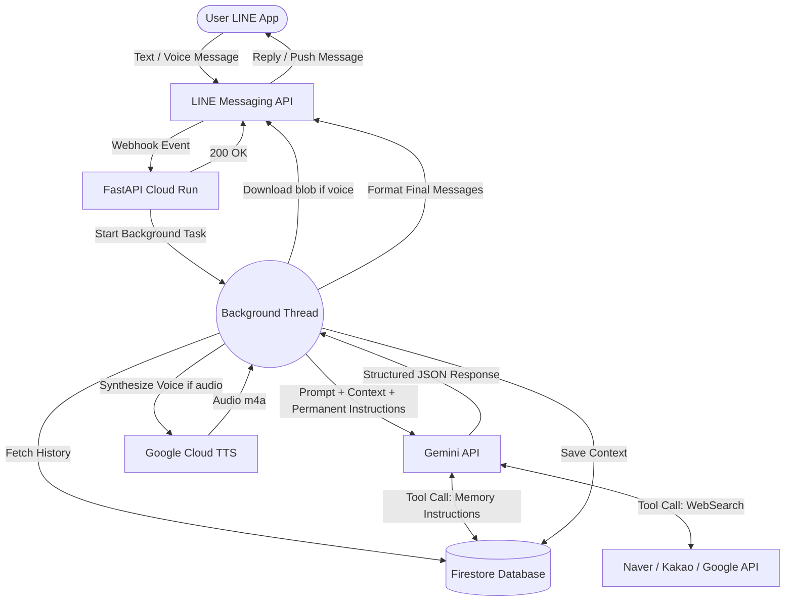

# 🇰🇷🇯🇵 KoreanTeacher_LINE

An incredibly dynamic, AI-powered interactive Korean ↔ Japanese Teacher bot built natively for LINE! Mentored by **Teacher Kim Hyun-woo (김현우)**, this bot helps Japanese beginners learn Korean naturally through fully bilingual voice interaction, automatic translation, and permanent memory retention.

## ✨ Features

- **👨‍🏫 Teacher Kim Hyun-woo (김현우)**
  - A professional but warm persona tailored for beginners. He focuses on small, foundational mistakes (particles, conjugations) to ensure a strong language start.
- **🔄 Automatic Korean ↔ Japanese Translation**
  - Write in Korean → get an automatic Japanese translation. Write in Japanese → get an automatic Korean translation. Both directions are always covered.
- **🗣️ Adaptive Audio + Enhanced Transcripts**
- **Audio for Voice messages**: Only voice inputs trigger an audio response, keeping text chats clean and fast.
- **Improved Formatting**: Transcripts now include a clear line break after the translation line for better readability.
- **One-at-a-time Audio**: Responses provide a single high-quality audio file matching the user's input language (Korean or Japanese).
- **⚡ Ultra-Concise & Simple**
  - No more verbosity! Responses are strictly brief (1-2 sentences) and utilize elementary-level Korean vocabulary for maximum comprehension.
- **🧠 Permanent Conversational Memory & Preferences**
  - Natively tracks users across individual `user_id`s, archiving their conversational progression into **Google Cloud Firestore**. Your teacher remembers what you chatted about yesterday!
  - Explicitly saves and respects specific user instructions over time (e.g., "Speak to me in polite language", "I'm a beginner") to customize the experience persistently.
- **☁️ Serverless Cloud Native**
  - Container-based execution architected perfectly for **Google Cloud Run**, meaning incredibly fast deployments that gracefully scale to zero when inactive!

## ⚙️ Core Technology Stack

- **[FastAPI](https://fastapi.tiangolo.com/)**: The incredibly fast asynchronous backend router processing incoming LINE Webhook events.
- **[Gemini AI SDK](https://ai.google.dev/)**: Powered by the highly intelligent `gemini-3.5-flash` model utilizing structural JSON directive parsing.
- **[LINE Messaging API](https://developers.line.biz/en/docs/messaging-api/)**: The native pipeline allowing users to practice language intuitively via standard social text/voice messaging.
- **Google Cloud Suite**:
  - `Cloud Run`: Serverless hosting
  - `Firestore`: Rapid NoSQL contextual memory
  - `Cloud Text-to-Speech`: High-fidelity Neural2 Audio Mapping

## 🏗️ Architecture Flow



## 📁 Folder Structure

- `app/` - Contains the Python application code (`main.py`, `gemini_client.py`, `web_search.py`).
- `Dockerfile` - Container image configuration.
- `deploy.ps1` - PowerShell script for deploying to Cloud Run.
- `requirements.txt` - Python dependencies.

## 🚀 Quickstart Deployment

### 1. Requirements

Ensure you have a **LINE Developer Console Channel** and a **Google Cloud Project** fully enabled.

You'll need these secret tokens securely loaded in a local `.env` file for testing:
```bash
LINE_CHANNEL_SECRET=your_secret
LINE_CHANNEL_ACCESS_TOKEN=your_token
GEMINI_API_KEY=your_gemini_key
GOOGLE_CLOUD_PROJECT=your_gcp_project_id
```

### 2. Required GCP APIs

To get the most out of the conversational tracking and natural voices, you must enable the following APIs on your Google Cloud Console:
- Google Cloud Firestore (`firestore.googleapis.com`)
- Google Cloud Text-to-Speech (`texttospeech.googleapis.com`)

### 3. Deploying

This project is built to deploy purely from the shell using standard `gcloud` logic. Ensure Docker and the Google Cloud CLI are installed, then execute:

```powershell
.\deploy.ps1
```

Once pushed to Cloud Run, simply update your webhook string in the LINE Developer Console with the generated endpoint (`https://YOUR-URL.run.app/callback`), then turn off LINE's native auto-reply system!

## 🤝 Contribution

Feel free to fork the repository and submit pull requests if you want to experiment with different teaching prompts, tighter memory tracking, or expanding the bot logic to support English learners!
