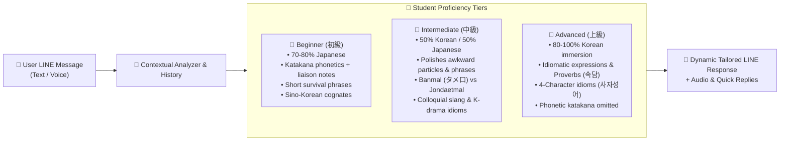

# 🇰🇷🇯🇵 KoreanTeacher_LINE

An AI-powered interactive Korean learning partner and friendly guide built natively for LINE! Mentored by **Teacher Kim Hyun-woo (김현우)**, this bot helps Japanese learners speak and understand Korean effortlessly and with fun—just like chatting with a warm, encouraging native Korean friend and teacher.

> 📖 [日本語版 README (Japanese version)](./README.ja.md)

---

## ✨ Features

- **👨‍🏫 Teacher Kim Hyun-woo (김현우)**
  - A friendly, encouraging native Korean teacher from Seoul who loves Japan. Acts like a supportive older brother (ヒョヌ/オッパ) who celebrates your progress and chats naturally.
- **🤝 Dynamic Human-Like Conversation & Anti-Repetition**
  - Truly conversational and alive: never outputs identical canned explanations or duplicate phrase cards when the user repeats the same input or greeting.
  - Recognizes repeated practice ("대박! You used the phrase right away!👏") and provides fresh variations, nuanced tips, or moves the dialogue forward naturally.
- **🎯 Persistent Proficiency Level Adaptation**
  - Remembers each user's proficiency level (`beginner`, `intermediate`, `advanced`) in **Firestore** and dynamically adjusts tone, language ratio, and depth:
    - **Beginner (初級)**: ~80% Japanese, friendly Katakana phonetic hints (liaison/sound change notes), high-frequency survival phrases, Sino-Korean cognates.
    - **Intermediate (中級)**: 50/50 Korean/Japanese blend, natural native collocations, polishes awkward particles, deep dive into 반말 (informal) vs 존댓말 (polite) nuances and trending slang.
    - **Advanced (上級)**: 80–100% Korean immersion, idiomatic expressions, proverbs (속담), four-character idioms (사자성어), cultural and trending topics; Katakana hints omitted.
  - Automatically infers proficiency from user inputs or respects explicit declarations ("I am a beginner", "I have TOPIK level 5").
- **💬 Natural Conversational Immersion (No Robotic Grading)**
  - Replaces rigid "grading/error reports" with organic, supportive conversation. Corrections and natural native nuances are seamlessly woven into chat reactions.
- **✨ Structured Korean Expression Cards**
  - When learning or chatting, key Korean phrases are highlighted with Japanese Katakana pronunciation hints (covering liaison/sound changes) and clear translations.
- **🔘 Interactive LINE Quick Reply Buttons**
  - Provides 2–4 dynamic one-tap buttons with every message (e.g. `[네, 맞아요!]`, `[タメ口では？]`, `[発音を聞かせて🔊]`), removing the friction of typing Hangul on mobile.
- **🗣️ Adaptive & On-Demand Audio Pronunciation**
  - Listens to student voice messages and provides warm spoken feedback.
  - Generates native Korean audio on demand whenever the learner taps `[発音を聞かせて🔊]` or asks to hear pronunciation.
- **💡 "Kanji-go / Cognate" Aha Moments**
  - Actively leverages the ~70% shared Sino-Korean vocabulary (e.g. 약속 = 約束, 무료 = 無料) to build immediate confidence for Japanese speakers.
- **🔍 Real-Time Korean Trend & Travel Search**
  - Uses custom function calling tools integrated with Naver Search (Blog & Web), Kakao/Daum Search, and Google Custom Search to provide accurate, up-to-date recommendations for cafes, restaurants, tourist spots, and slang.
- **🧠 Short-Term & Long-Term Memory Architecture**
  - **Short-Term Context**: Retains recent turns per user (sliding window of 12 turns / 6 message pairs injected into active Gemini chat context) to maintain fluid dialogue continuity, recognize repeated practice, and prevent canned answers.
  - **Long-Term Memory**: Automatically persists user proficiency levels and explicitly saves custom instructions/preferences (e.g. learning goals, nicknames, favorite idols) to **Google Cloud Firestore**, restoring them seamlessly across sessions.
- **☁️ Serverless Cloud Native**
  - Container-based execution architected for **Google Cloud Run**, providing scalable deployments that scale to zero when inactive.

---

## ⚙️ Core Technology Stack

| Component | Technology | Role |
|---|---|---|
| **Backend Framework** | [FastAPI](https://fastapi.tiangolo.com/) | Asynchronous webhook routing, health checks, and audio streaming |
| **Generative AI** | [Google GenAI SDK](https://ai.google.dev/) (`gemini-3.8-flash`) | Contextual conversation, JSON schema enforcement, and tool execution |
| **Messaging Platform** | [LINE Messaging API SDK v3](https://developers.line.biz/en/docs/messaging-api/) | Webhook parsing, rich text cards, audio messages, and quick reply actions |
| **Database & Memory** | [Google Cloud Firestore](https://cloud.google.com/firestore) | Contextual history preservation and persistent user preferences |
| **Speech & Audio** | [Google Cloud Text-to-Speech](https://cloud.google.com/text-to-speech) + `ffmpeg` | Neural2 speech synthesis (`ko-KR-Neural2-C` & `ja-JP-Neural2-D`) and AAC conversion |
| **Search Integrations** | [Naver Developers](https://developers.naver.com/) & [Kakao Developers](https://developers.kakao.com/) | Real-time Korean web, blog, and local info retrieval |
| **Hosting & Container** | [Google Cloud Run](https://cloud.google.com/run) & Docker | Fully managed serverless container runtime |

---

## 📱 Visual System & User Experience Preview

### 1. Interactive LINE Chat Experience (Beginner & Repetition Handling)

```
┌────────────────────────────────────────────────────────┐
│ 🟢 LINE Chat: Kim Hyun-woo (キム・ヒョンウ先生)        │
├────────────────────────────────────────────────────────┤
│                                                        │
│ [Student] 👤                                          │
│ 今日めっちゃ疲れた〜                                   │
│                                                        │
│ 👨‍🏫 [Teacher Kim]                                      │
│ 今日もお疲れ様でした！本当によく頑張りましたね✨        │
│ 韓国語では『오늘 너무 피곤했어요~』って言います。     │
│ 温かいお風呂に入ってゆっくり休んでくださいね！         │
│ 明日は何時に起きる予定ですか？                         │
│                                                        │
│ ┌────────────────────────────────────────────────────┐ │
│ │ ✨ 今日のキー表現：                                │ │
│ │ 『 오늘 너무 피곤했어요 』                         │ │
│ │ 🗣️ 発音：オヌル ノム ピゴネッソヨ                   │ │
│ │ 🇯🇵 意味：今日すごく疲れました                       │ │
│ └────────────────────────────────────────────────────┘ │
│                                                        │
│ [Student] 👤                                          │
│ 오늘 너무 피곤했어요                                   │
│                                                        │
│ 👨‍🏫 [Teacher Kim]                                      │
│ 대박! 早速使ってくれましたね！👏 発音もバッチリ伝わって│
│ きます！友達同士のタメ口なら『오늘 너무 피곤했어』     │
│ って末尾を軽く言えばOKですよ😊 今夜はぐっすり眠れそう? │
│                                                        │
│ ┌────────────────────────────────────────────────────┐ │
│ │ 🔊 音声メッセージ (m4a) [▶ 0:02 / 0:02]            │ │
│ └────────────────────────────────────────────────────┘ │
│                                                        │
├────────────────────────────────────────────────────────┤
│ 💡 Quick Replies:                                      │
│ [네! (はい!)]  [タメ口では？]  [発音を聞かせて🔊]      │
└────────────────────────────────────────────────────────┘
```

### 2. Multi-Level Proficiency Adaptive Behavior



---

## 🏗️ Architecture & Data Flow


---

## 📁 Project Structure

Curated workspace directory structure highlighting key files and components:

```
KoreanTeacher_LINE/
├── app/
│   ├── __init__.py           # Package marker
│   ├── gemini_client.py      # Gemini model configuration, persona prompt, Firestore memory & tools
│   ├── main.py               # FastAPI application, LINE webhook handlers, TTS pipeline & background jobs
│   └── web_search.py         # Naver, Kakao, and Google Custom Search integration modules
├── docs/
│   └── naver_kakao_api_guide.md  # Setup walkthrough for obtaining Naver and Kakao API keys
├── .dockerignore             # Excludes unnecessary build artifacts from Docker image
├── .gcloudignore             # Excludes files from Cloud Build packaging
├── .gitignore                # Git hygiene configuration
├── deploy.ps1                # Automated Cloud Run build and deployment PowerShell script
├── Dockerfile                # Production container specification with Python 3.11-slim & ffmpeg
├── README.md                 # Project documentation and architectural guide
└── requirements.txt          # Python dependencies
```

Key workspace files:
- [app/main.py](app/main.py): Entry point containing FastAPI routes, LINE webhook handlers, and audio streaming endpoints.
- [app/gemini_client.py](app/gemini_client.py): Core AI logic configuring `gemini-3.8-flash`, Pydantic response models, system prompt, and Firestore persistence.
- [app/web_search.py](app/web_search.py): Autonomous search tools for Naver Blog/Webkr, Kakao Web/Blog, and Google Custom Search.
- [docs/naver_kakao_api_guide.md](docs/naver_kakao_api_guide.md): Guide for registering applications and obtaining Naver & Kakao API keys.
- [deploy.ps1](deploy.ps1): Automated deployment script to Google Cloud Run.
- [Dockerfile](Dockerfile): Production container specification with non-root security and `ffmpeg` support.
- [requirements.txt](requirements.txt): Application dependencies list.

---

## 🔌 API Endpoints Summary

| Endpoint | Method | Description |
|---|---|---|
| `/callback` | `POST` | LINE Messaging API webhook endpoint. Validates signature (`X-Line-Signature`) and handles text, audio, unfollow, and room leave events. |
| `/health` | `GET` | Health check and diagnostics endpoint. Returns service status, active Gemini model, base URL, and search integration statuses. |
| `/audio/{filename}` | `GET` | Serves synthesized `.m4a` speech files for LINE `AudioMessage` playback. |

---

## 🧠 Memory Architecture (Short-Term & Long-Term)

To ensure personalized, high-value learning over extended periods, the bot incorporates a dual-tier memory system per user ID:

| Tier | Scope & Storage | How It Works |
|---|---|---|
| **Short-Term Context** | In-flight turns (Firestore / Cache) | Keeps a sliding window of the **12 most recent turns (6 conversational exchanges)** directly in the active Gemini context. Evaluates dialogue flow to detect whether the user is repeating a message (triggering alternative phrasing) or practicing a taught expression (triggering praise). |
| **Long-Term Memory** | Permanent user profile (Firestore) | Persists the user's **proficiency level** (`beginner`, `intermediate`, `advanced`) and explicit **custom preferences/instructions** (e.g., nicknames, learning goals, favorite artists, speech preferences). These are injected into the system instruction on every turn across all sessions. |

*Privacy note: If a user unfollows or blocks the bot, their stored chat history and profile are automatically purged from Firestore.*

---

## ☁️ Multi-PC Cloud Native Architecture

KoreanTeacher_LINE is architected for zero-friction portability across multiple machines (Windows/macOS/Linux) and Google Cloud Run containers:

```
+-----------------------------------------------------------------------------------+
| Multi-PC Local Machine (Windows/Mac/Linux)      Cloud Run Production Container    |
| (Authenticated via `gcloud auth login` / ADC)   (Default Compute Service Account) |
+-----------------------------------------------------------------------------------+
                                         |
                                         v
               +---------------------------------------------------+
               | Dual-Mode Configuration Manager (app/config.py)   |
               | 1. google-cloud-secret-manager Python SDK (ADC)   |
               | 2. gcloud CLI fallback (`secrets versions access`)|
               | 3. Local OS Temp / Environment Variable Fallback  |
               +---------------------------------------------------+
                                         |
            +----------------------------+----------------------------+
            |                                                         |
            v                                                         v
+-------------------------------+                         +-------------------------------+
| Google Cloud Secret Manager   |                         | Google Cloud Storage (GCS)    |
| - gemini-api-key              |                         | - State/Profile Memory        |
| - korean-teacher-line-channel |                         |   gs://<bucket>/korean_teacher|
|   -secret / -access-token     |                         |   /user_cache.json            |
| - naver / kakao / search keys |                         | - Decoupled Audit/Run Logs    |
+-------------------------------+                         |   gs://<bucket>/korean_teacher|
                                                          |   /run_log.json               |
                                                          +-------------------------------+
```

### 1. Cloud Secret Resolution (Zero Setup)
No local `.env` or `token.json` file is required. When running on any PC or Cloud Run instance:
1. The app automatically fetches secrets from **Google Cloud Secret Manager**.
2. If local Application Default Credentials (ADC) are not configured, it transparently falls back to the authenticated `gcloud` CLI.
3. Secrets are cached in-memory during execution for ultra-fast response times.

### 2. State & Memory Migration (Cloud Storage)
- User profile memory, instruction preferences, and fallback cache are stored directly in **Google Cloud Storage** (`gs://<project_id>-korean-teacher-data/korean_teacher/`).
- Local offline execution defaults temporary fallback caches to the OS temporary directory (`tempfile.gettempdir()`), ensuring the Git repository root is **never polluted** with local state or cache files.

### 3. Decoupled Operational & Execution Logs
- Execution durations, timestamps, error traces, and audit logs are decoupled from conversational state.
- Operational logs are stored in `gs://<project_id>-korean-teacher-data/korean_teacher/run_log.json` and streamed as structured JSON to `stdout` for ingestion by **Google Cloud Logging**.

---

## 🔑 Configuration & Secret Manager Keys

| Key / Setting | Secret Manager ID | Environment Fallback | Description |
|---|---|---|---|
| Gemini API Key | `gemini-api-key` | `GEMINI_API_KEY` | Google Gemini API Key for model inference. |
| LINE Channel Secret | `korean-teacher-line-channel-secret` | `LINE_CHANNEL_SECRET` | LINE Messaging API Channel Secret for webhook verification. |
| LINE Access Token | `korean-teacher-line-channel-access-token` | `LINE_CHANNEL_ACCESS_TOKEN` | LINE Messaging API Channel Access Token for sending replies. |
| GCP Project ID | — | `GOOGLE_CLOUD_PROJECT` | GCP Project ID (auto-detected via `gcloud` if unset). |
| GCS Bucket Name | `korean-teacher-bucket-name` | `GCS_BUCKET_NAME` | Cloud Storage bucket (default: `<project-id>-korean-teacher-data`). |
| Public Base URL | — | `BASE_URL` | Webhook URL / Cloud Run URL for audio serving. |
| Naver Search (Optional)| `naver-client-id`, `naver-client-secret` | `NAVER_CLIENT_ID`, `NAVER_CLIENT_SECRET` | Naver Search credentials for local trend retrieval. |
| Kakao Search (Optional)| `kakao-rest-api-key` | `KAKAO_REST_API_KEY` | Kakao Search credentials for web and blog search. |
| Google Custom Search (Optional) | `google-search-api-key`, `google-search-cx` | `GOOGLE_SEARCH_API_KEY`, `GOOGLE_SEARCH_CX` | Google Custom Search API credentials. |

---

## 🛠️ Multi-PC Setup & Sync Utility (`sync_secrets.py`)

The included `sync_secrets.py` tool simplifies cloud setup and verification across any machine:

```bash
# 1. Run zero-setup dry-run verification (tests Secret Manager & GCS connectivity)
python sync_secrets.py --dry-run

# 2. Ensure the Cloud Storage bucket is created
python sync_secrets.py --init-bucket

# 3. Push local .env secrets to Google Cloud Secret Manager in one shot (optional)
python sync_secrets.py --push-env .env
```

---

## 💻 Local Development Setup

### 1. Prerequisites

- **Python 3.11+**
- **FFmpeg & FFprobe** installed in system `PATH`
- **Google Cloud CLI (`gcloud`)** authenticated:
  ```bash
  gcloud auth login
  gcloud config set project <YOUR_PROJECT_ID>
  ```

### 2. Dependencies

```bash
pip install -r requirements.txt
```

### 3. Verify Cloud Access & Run

```bash
# Verify cloud access
python sync_secrets.py --dry-run

# Start local server
uvicorn app.main:app --reload --host 0.0.0.0 --port 8000
```

---

## 🚀 Google Cloud Run Deployment

The project includes an automated deployment script [deploy.ps1](deploy.ps1) for Google Cloud Run:

```powershell
# Review and deploy to Cloud Run (Tokyo region: asia-northeast1)
.\deploy.ps1
```

The script automatically ensures the GCS bucket exists and deploys the container to Cloud Run. Cloud Run securely accesses Secret Manager and Cloud Storage via IAM roles without embedding plaintext secrets in environment variables.

---

## 🤝 Contribution

Contributions and ideas are welcome! You can:
- Experiment with customized teaching prompts in [app/gemini_client.py](app/gemini_client.py).
- Enhance conversational memory handling and user preference categories.
- Add new search providers or cultural knowledge tools in [app/web_search.py](app/web_search.py).
- Expand support for additional languages or test suites.

Feel free to open an issue or submit a pull request!
