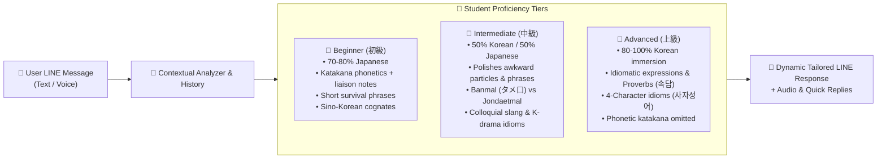
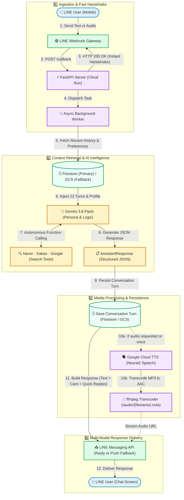
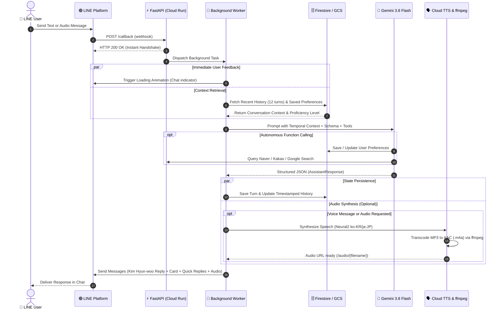
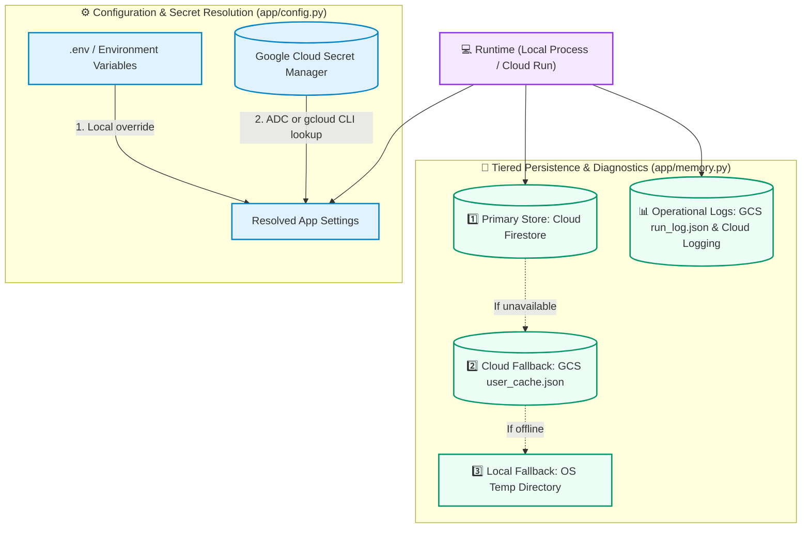

# 🇰🇷🇯🇵 KoreanTeacher_LINE

An AI-powered interactive Korean learning partner and friendly guide built natively for LINE! Mentored by **Teacher Kim Hyun-woo (김현우)**, this bot helps Japanese speakers learning Korean speak and understand the language effortlessly and with fun—just like chatting with a warm, encouraging native Korean friend and teacher.

> 📖 [日本語版 README (Japanese version)](./README.ja.md)

---

## ✨ Features

- **👨‍🏫 Teacher Kim Hyun-woo (김현우)**
  - A friendly, encouraging native Korean teacher from Seoul who loves Japan. Acts like a supportive older brother (ヒョヌ/オッパ) who celebrates your progress and chats naturally.
- **🤝 Dynamic Human-Like Conversation & Anti-Repetition**
  - Truly conversational and alive: never outputs identical canned explanations or duplicate phrase cards when the user repeats the same input or greeting.
  - Recognizes repeated practice ("대박! You used the phrase right away!👏") and provides fresh variations, nuanced tips, or moves the dialogue forward naturally.
- **🎯 Persistent Proficiency Level Adaptation**
  - Remembers each user's proficiency level (`beginner`, `intermediate`, `advanced`) in **Firestore** and dynamically adjusts tone, language ratio, and depth:
    - **Beginner (初級)**: ~80% Japanese, friendly Katakana phonetic hints (liaison/sound change notes), high-frequency survival phrases, Sino-Korean cognates.
    - **Intermediate (中級)**: 50/50 Korean/Japanese blend, natural native collocations, polishes awkward particles, deep dive into 반말 (informal) vs 존댓말 (polite) nuances and trending slang.
    - **Advanced (上級)**: 80–100% Korean immersion, idiomatic expressions, proverbs (속담), four-character idioms (사자성어), cultural and trending topics; Katakana hints omitted.
  - Automatically infers proficiency from user inputs or respects explicit declarations ("I am a beginner", "I have TOPIK level 5").
- **💬 Natural Conversational Immersion (No Robotic Grading)**
  - Replaces rigid "grading/error reports" with organic, supportive conversation. Corrections and natural native nuances are seamlessly woven into chat reactions.
- **✨ Structured Korean Expression Cards**
  - When learning or chatting, key Korean phrases are highlighted with Japanese Katakana pronunciation hints (covering liaison/sound changes) and clear translations.
- **🔘 Interactive LINE Quick Reply Buttons**
  - Provides 2–4 dynamic one-tap buttons with every message (e.g. `[네, 맞아요!]`, `[タメ口では？]`, `[発音を聞かせて🔊]`), removing the friction of typing Hangul on mobile.
- **🗣️ Adaptive & On-Demand Audio Pronunciation**
  - Listens to student voice messages and provides warm spoken feedback.
  - Generates native Korean audio on demand whenever the learner taps `[発音を聞かせて🔊]` or asks to hear pronunciation.
- **💡 "Kanji-go / Cognate" Aha Moments**
  - Actively leverages the ~70% shared Sino-Korean vocabulary (e.g. 약속 = 約束, 무료 = 無料) to build immediate confidence for Japanese speakers.
- **🔍 Real-Time Korean Trend & Travel Search**
  - Uses custom function calling tools integrated with Naver Search (Blog & Web), Kakao/Daum Search, and Google Custom Search to provide accurate, up-to-date recommendations for cafes, restaurants, tourist spots, and slang.
- **🧠 Time-Aware Short-Term & Long-Term Memory Architecture**
  - **Time-Aware Short-Term Context**: Stores up to 40 turns per user and sends a sliding window of the 12 most recent turns (6 message pairs) to Gemini, with ISO-8601 timestamps (JST/KST - UTC+9). Calculates elapsed time between turns to provide Kim Hyunwoo with temporal context (morning vs. evening, same-day continuations vs. multi-day resumptions). Intelligently differentiates immediate practice from long-term memory retention, and avoids false repeat warnings when standard greetings occur across days.
  - **Long-Term Memory**: Automatically persists user proficiency levels, conversation history, and explicitly saved preferences (e.g. learning goals, nicknames, favorite idols) in **Google Cloud Firestore**. If Firestore cannot initialize, the app uses a JSON state cache in **Google Cloud Storage** (or the local OS temp directory when cloud storage is unavailable).
  - **Proactive Inactivity Check-ins (Re-engagement)**: Periodically checks for students who have been inactive for 3–14 days and sends warm, zero-pressure check-in messages from Kim Hyunwoo via LINE push messages (orchestrated via `/cron/check-in` and Google Cloud Scheduler, with a strict 7-day cooldown).
- **☁️ Serverless Cloud Native**
  - Container-based execution architected for **Google Cloud Run**, providing scalable deployments that scale to zero when inactive.

---

## ⚙️ Core Technology Stack

| Component | Technology | Role |
|---|---|---|
| **Backend Framework** | [FastAPI](https://fastapi.tiangolo.com/) | Asynchronous webhook routing, health checks, and audio streaming |
| **Generative AI** | [Google GenAI SDK](https://ai.google.dev/) (`gemini-3.8-flash`) | Contextual conversation, JSON schema enforcement, and tool execution |
| **Messaging Platform** | [LINE Messaging API SDK v3](https://developers.line.biz/en/docs/messaging-api/) | Webhook parsing, rich text cards, audio messages, and quick reply actions |
| **Database & Memory** | [Google Cloud Firestore](https://cloud.google.com/firestore) | Contextual history preservation and persistent user preferences |
| **Speech & Audio** | [Google Cloud Text-to-Speech](https://cloud.google.com/text-to-speech) + `ffmpeg` | Neural2 speech synthesis (`ko-KR-Neural2-C` & `ja-JP-Neural2-D`) and AAC conversion |
| **Search Integrations** | [Naver Developers](https://developers.naver.com/) & [Kakao Developers](https://developers.kakao.com/) | Real-time Korean web, blog, and local info retrieval |
| **Hosting & Container** | [Google Cloud Run](https://cloud.google.com/run) & Docker | Fully managed serverless container runtime |

---

## 📱 Visual System & User Experience Preview

### 1. Interactive LINE Chat Experience (Beginner & Repetition Handling)

```
┌────────────────────────────────────────────────────────┐
│ 🟢 LINE Chat: Kim Hyun-woo (キム・ヒョンウ先生)        │
├────────────────────────────────────────────────────────┤
│                                                        │
│ [Student] 👤                                          │
│ 今日めっちゃ疲れた〜                                   │
│                                                        │
│ 👨‍🏫 [Teacher Kim]                                      │
│ 今日もお疲れ様でした！本当によく頑張りましたね✨        │
│ 韓国語では『오늘 너무 피곤했어요~』って言います。     │
│ 温かいお風呂に入ってゆっくり休んでくださいね！         │
│ 明日は何時に起きる予定ですか？                         │
│                                                        │
│ ┌────────────────────────────────────────────────────┐ │
│ │ ✨ 今日のキー表現：                                │ │
│ │ 『 오늘 너무 피곤했어요 』                         │ │
│ │ 🗣️ 発音：オヌル ノム ピゴネッソヨ                   │ │
│ │ 🇯🇵 意味：今日すごく疲れました                       │ │
│ └────────────────────────────────────────────────────┘ │
│                                                        │
│ [Student] 👤                                          │
│ 오늘 너무 피곤했어요                                   │
│                                                        │
│ 👨‍🏫 [Teacher Kim]                                      │
│ 대박! 早速使ってくれましたね！👏 発音もバッチリ伝わって│
│ きます！友達同士のタメ口なら『오늘 너무 피곤했어』     │
│ って末尾を軽く言えばOKですよ😊 今夜はぐっすり眠れそう? │
│                                                        │
│ ┌────────────────────────────────────────────────────┐ │
│ │ 🔊 音声メッセージ (m4a) [▶ 0:02 / 0:02]            │ │
│ └────────────────────────────────────────────────────┘ │
│                                                        │
├────────────────────────────────────────────────────────┤
│ 💡 Quick Replies:                                      │
│ [네! (はい!)]  [タメ口では？]  [発音を聞かせて🔊]      │
└────────────────────────────────────────────────────────┘
```

### 2. Multi-Level Proficiency Adaptive Behavior



---

## 🏗️ Architecture & Data Flow

To eliminate LINE webhook timeouts and ensure rapid, dependable user feedback, the application completely decouples the instant HTTP webhook acknowledgment (`HTTP 200 OK`) from the heavier AI inference, search tool calling, speech synthesis, and persistence layers.

### 1. End-to-End Processing Pipeline



### 2. Request-Response Sequence & Async Lifecycle



---

## 📁 Project Structure

Curated workspace directory structure highlighting key files and components:

```
KoreanTeacher_LINE/
├── app/
│   ├── __init__.py               # Package marker
│   ├── config.py                 # Multi-PC configuration & Secret Manager resolution
│   ├── gemini_client.py          # Gemini model configuration, persona prompt, Firestore memory & tools
│   ├── main.py                   # FastAPI application, LINE webhook handlers, TTS pipeline & background jobs
│   ├── memory.py                 # Dual-layer GCS state persistence & decoupled audit logging
│   └── web_search.py             # Naver, Kakao, and Google Custom Search integration modules
├── docs/
│   └── naver_kakao_api_guide.md  # Setup walkthrough for obtaining Naver and Kakao API keys
├── scripts/
│   ├── deploy.ps1                # Automated Cloud Run build and deployment PowerShell script
│   ├── sync_secrets.py           # Multi-PC Secret Manager synchronization & GCS initialization
│   └── trigger_check_in.py       # Preview or send inactivity check-ins from the command line
├── .dockerignore                 # Excludes unnecessary build artifacts from Docker image
├── .env.example                  # Environment variable schema and configuration reference
├── .gcloudignore                 # Excludes files from Cloud Build packaging
├── .gitignore                    # Git hygiene configuration
├── Dockerfile                    # Production container specification with Python 3.11-slim & ffmpeg
├── README.md                     # Project documentation and architectural guide
├── README.ja.md                  # Japanese project documentation
└── requirements.txt              # Python dependencies
```

Key workspace files:
- [app/main.py](app/main.py): Entry point containing FastAPI routes, LINE webhook handlers, and audio streaming endpoints.
- [app/config.py](app/config.py): Dual-mode configuration manager resolving secrets via Secret Manager SDK, `gcloud` CLI fallback, or environment variables.
- [app/gemini_client.py](app/gemini_client.py): Core AI logic configuring `gemini-3.8-flash`, Pydantic response models, system prompt, and Firestore persistence.
- [app/memory.py](app/memory.py): GCS JSON state persistence and stdout-streamed structured audit logging; local fallback files are kept in the OS temp directory.
- [app/web_search.py](app/web_search.py): Autonomous search tools for Naver Blog/Webkr, Kakao Web/Blog, and Google Custom Search.
- [docs/naver_kakao_api_guide.md](docs/naver_kakao_api_guide.md): Guide for registering applications and obtaining Naver & Kakao API keys.
- [scripts/deploy.ps1](scripts/deploy.ps1): Automated deployment script to Google Cloud Run.
- [scripts/sync_secrets.py](scripts/sync_secrets.py): Multi-PC secret synchronization and zero-setup dry-run diagnostics.
- [scripts/trigger_check_in.py](scripts/trigger_check_in.py): Preview check-in messages or explicitly dispatch them to eligible LINE users.
- [Dockerfile](Dockerfile): Production container specification with non-root security and `ffmpeg` support.
- [requirements.txt](requirements.txt): Application dependencies list.

---

## 🔌 API Endpoints Summary

| Endpoint | Method | Description |
|---|---|---|
| `/callback` | `POST` | LINE Messaging API webhook endpoint. Validates signature (`X-Line-Signature`) and handles text, audio, unfollow, and room leave events. |
| `/health` | `GET` | Health check and diagnostics endpoint. Returns service status, active Gemini model, base URL, and search integration statuses. |
| `/audio/{filename}` | `GET` | Serves synthesized `.m4a` speech files for LINE `AudioMessage` playback. |
| `/cron/check-in` | `POST` / `GET` | Scans for inactive users (default: 3–14 days) and returns generated check-ins; sends LINE push messages unless `dry_run=true`. Configure `CRON_SECRET` to require the `X-Cron-Secret` header or `secret` query parameter. Supports `min_days`, `max_days`, `cooldown_days`, and `dry_run` query parameters. |

---

## 🧠 Memory & Context Architecture

To ensure personalized, high-value learning over extended periods, the bot incorporates a multi-tier memory and temporal context system:

| Component | Scope & Storage | How It Works |
|---|---|---|
| **Time-Aware Short-Term Context** | Firestore; GCS JSON fallback if Firestore is unavailable | Stores conversation turns with ISO-8601 timestamps (JST/KST - UTC+9), retains up to 40 turns, and sends the **12 most recent turns (6 conversational exchanges)** to Gemini. Elapsed time informs conversational pacing, from an ongoing exchange to a same-day or multi-day resumption. |
| **Long-Term Memory** | Firestore; GCS JSON fallback if Firestore is unavailable | Persists the user's **proficiency level** (`beginner`, `intermediate`, `advanced`) and explicit **custom preferences/instructions** (e.g., nicknames, learning goals, favorite artists, speech preferences). These are injected into the system instruction on every turn across all sessions. |
| **Proactive Check-Ins (Re-engagement)** | `/cron/check-in` endpoint or `scripts/trigger_check_in.py` | Finds students inactive for **3 to 14 days** by default and generates a check-in with Quick Reply options. Live sends enforce a **7-day cooldown** by default and respect opt-out preferences. The endpoint is unauthenticated unless `CRON_SECRET` is configured. |

*Privacy note: If a user unfollows or blocks the bot, the app deletes that user's stored history and profile from Firestore and the GCS fallback cache.*

---

## ☁️ Multi-PC Cloud Native Architecture

Local development and Cloud Run use the same configuration and persistence code. Environment variables take precedence over Secret Manager; Secret Manager uses Application Default Credentials (ADC), with the `gcloud` CLI as a fallback for secret reads. Firestore is the primary store for user conversation and profile data; GCS holds a JSON fallback cache and operational logs.



### 1. Cloud Secret Resolution (Zero Setup)
Local `.env` values override secrets. Otherwise, the app looks up secrets in **Google Cloud Secret Manager** using ADC, then tries the authenticated `gcloud` CLI. Resolved secrets are cached in memory for the process lifetime.

### 2. User State & Fallback Storage
- Conversation history and user profiles are stored in **Firestore** when its client can initialize.
- If Firestore is unavailable, state is read from and written to `gs://<bucket>/korean_teacher/user_cache.json`; GCS access can use the authenticated `gcloud storage` CLI if the Python SDK cannot access the bucket.
- If cloud storage is unavailable, the state module uses a cache under the OS temporary directory (`tempfile.gettempdir()`). This local fallback is not durable across machines or Cloud Run instances.

### 3. Decoupled Operational & Execution Logs
- Execution durations, timestamps, error traces, and audit logs are decoupled from conversational state.
- Operational logs are stored in `gs://<bucket>/korean_teacher/run_log.json` and streamed as structured JSON to `stdout` for ingestion by **Google Cloud Logging**.

---

## 🔑 Configuration & Secret Manager Keys

| Key / Setting | Secret Manager ID | Environment Fallback | Description |
|---|---|---|---|
| Gemini API Key | `gemini-api-key` | `GEMINI_API_KEY` | Google Gemini API Key for model inference. |
| LINE Channel Secret | `korean-teacher-line-channel-secret` | `LINE_CHANNEL_SECRET` | LINE Messaging API Channel Secret for webhook verification. |
| LINE Access Token | `korean-teacher-line-channel-access-token` | `LINE_CHANNEL_ACCESS_TOKEN` | LINE Messaging API Channel Access Token for sending replies. |
| GCP Project ID | — | `GOOGLE_CLOUD_PROJECT` or `GCP_PROJECT` | GCP Project ID (auto-detected from `gcloud` if unset). |
| GCS Bucket Name | `korean-teacher-bucket-name` | `GCS_BUCKET_NAME` | Cloud Storage bucket (default: `<project-id>-korean-teacher-data`; `korean-teacher` is used if no project can be resolved). |
| Gemini Model | — | `GEMINI_MODEL` | Model name (default: `gemini-3.8-flash`). |
| Public Base URL | — | `BASE_URL` | Public base URL used to construct TTS audio URLs (default: `http://localhost:8080`). Set this to the local server URL during development. |
| Container Port | Cloud Run `PORT` | `PORT` | Port bound by the Docker startup command (default: `8080`). The local Uvicorn example explicitly uses port `8000`. |
| Cron Secret (Optional) | `cron-secret` (default lookup) | `CRON_SECRET` | Enables authentication for `/cron/check-in`; accepted in `X-Cron-Secret` or the `secret` query parameter. Without it, the endpoint does not check a secret. |
| Naver Search (Optional)| `naver-client-id`, `naver-client-secret` | `NAVER_CLIENT_ID`, `NAVER_CLIENT_SECRET` | Naver Search credentials for local trend retrieval. |
| Kakao Search (Optional)| `kakao-rest-api-key` | `KAKAO_REST_API_KEY` | Kakao Search credentials for web and blog search. |
| Google Custom Search (Optional) | `google-search-api-key`, `google-search-cx` | `GOOGLE_SEARCH_API_KEY`, `GOOGLE_SEARCH_CX` | Google Custom Search API credentials. |

---

## 🛠️ Multi-PC Setup & Sync Utility (`scripts/sync_secrets.py`)

The included [scripts/sync_secrets.py](scripts/sync_secrets.py) tool simplifies cloud setup and verification across any machine:

```bash
# 1. Run zero-setup dry-run verification (tests Secret Manager & GCS connectivity)
python scripts/sync_secrets.py --dry-run

# 2. Ensure the Cloud Storage bucket is created
python scripts/sync_secrets.py --init-bucket

# 3. Push local .env secrets to Google Cloud Secret Manager in one shot (optional)
python scripts/sync_secrets.py --push-env .env
```

The utility accepts `--project <project-id>` to override the active `gcloud` project. Actions can be combined, for example `python scripts/sync_secrets.py --project <project-id> --init-bucket --dry-run`. `--push-env` uploads only recognized API credential variables; it does not upload settings such as `BASE_URL` or `GCS_BUCKET_NAME`.

### Inactivity Check-In Utility

Use [scripts/trigger_check_in.py](scripts/trigger_check_in.py) to preview eligible users and generated messages before sending. A dry run is the default; `--send` performs live LINE push delivery.

```bash
python scripts/trigger_check_in.py --dry-run
python scripts/trigger_check_in.py --send --min-days 3 --max-days 14 --cooldown-days 7
python scripts/trigger_check_in.py --user-id U12345678 --dry-run
```

---

## 💻 Local Development Setup

### 1. Prerequisites

- **Python 3.11+**
- **FFmpeg and FFprobe** installed in system `PATH` (the Docker image installs them through the `ffmpeg` package).
- Google Cloud credentials with access to the services used by enabled features. ADC-based SDK access can be configured with `gcloud auth application-default login`; the CLI secret/storage fallbacks require `gcloud auth login`.

Set the active project for the helper scripts:

```bash
gcloud config set project <YOUR_PROJECT_ID>
```

### 2. Dependencies

```bash
python -m pip install -r requirements.txt
```

For local development, create a `.env` file from [.env.example](.env.example) or set the values in your shell. The app loads `.env` automatically. Configure the Gemini API key and LINE channel credentials. Cloud-backed persistence requires Firestore access; TTS requires Text-to-Speech access. Set `BASE_URL=http://localhost:8000` so generated audio URLs use the local server port.

### 3. Verify Cloud Access & Run

```bash
# Verify cloud access
python scripts/sync_secrets.py --dry-run

# Start local server
uvicorn app.main:app --reload --host 0.0.0.0 --port 8000
```

Open `http://localhost:8000/health` to inspect service configuration. Register a publicly reachable `<BASE_URL>/callback` as the LINE webhook URL; local webhook testing requires exposing the local server through a public HTTPS tunnel.

---

## 🚀 Google Cloud Run Deployment

The [scripts/deploy.ps1](scripts/deploy.ps1) script builds from the repository root and deploys to Cloud Run. Defaults are service `korean-teacher-bot`, region `asia-northeast1`, and bucket `<project-id>-korean-teacher-data`.

```powershell
# Uses the active gcloud project and default service, region, and bucket
.\scripts\deploy.ps1

# Override deployment targets
.\scripts\deploy.ps1 -ProjectId "my-gcp-project" -AppName "korean-teacher-bot" -Region "asia-northeast1"
```

The script creates the default GCS bucket if needed, then deploys the service with public HTTP access so LINE can reach the webhook. A custom `-BucketName` must already exist; the script's bucket initialization creates only the default bucket. Grant the Cloud Run runtime service account the required access to Secret Manager, Firestore, Cloud Storage, and Text-to-Speech. Set `BASE_URL` to the deployed service URL and configure `CRON_SECRET` before scheduling `/cron/check-in`.

---

## 🤝 Contribution

Contributions and ideas are welcome! You can:
- Experiment with customized teaching prompts in [app/gemini_client.py](app/gemini_client.py).
- Enhance conversational memory handling and user preference categories.
- Add new search providers or cultural knowledge tools in [app/web_search.py](app/web_search.py).
- Expand support for additional languages or test suites.

Feel free to open an issue or submit a pull request!
